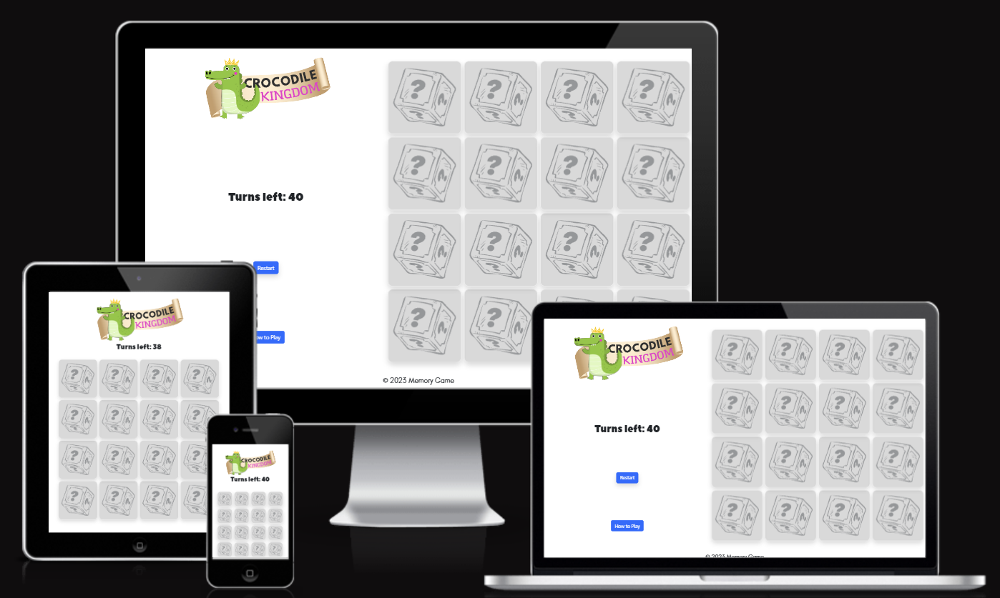
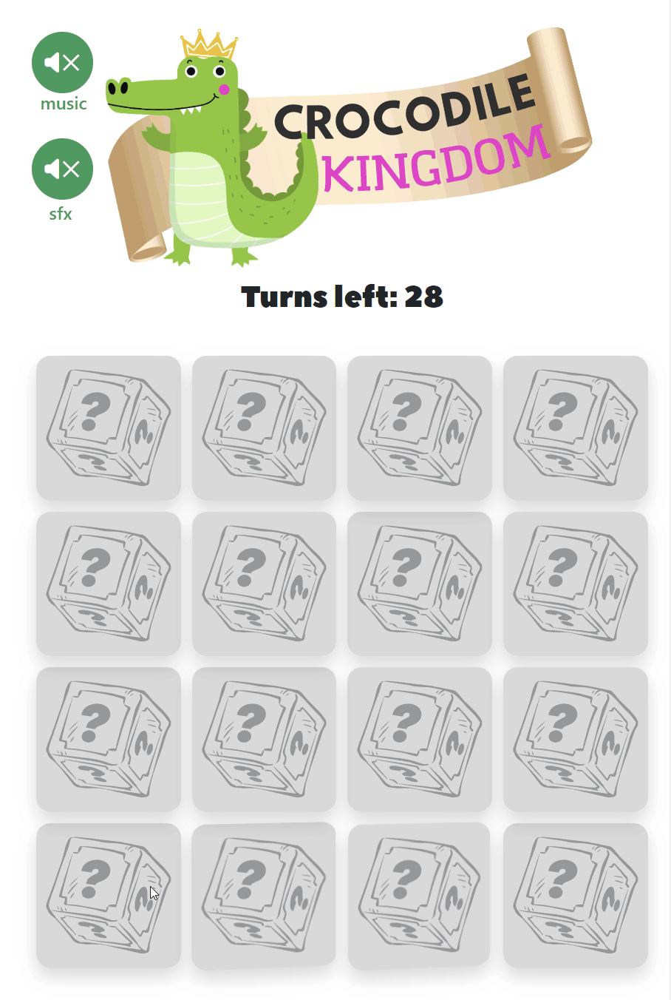
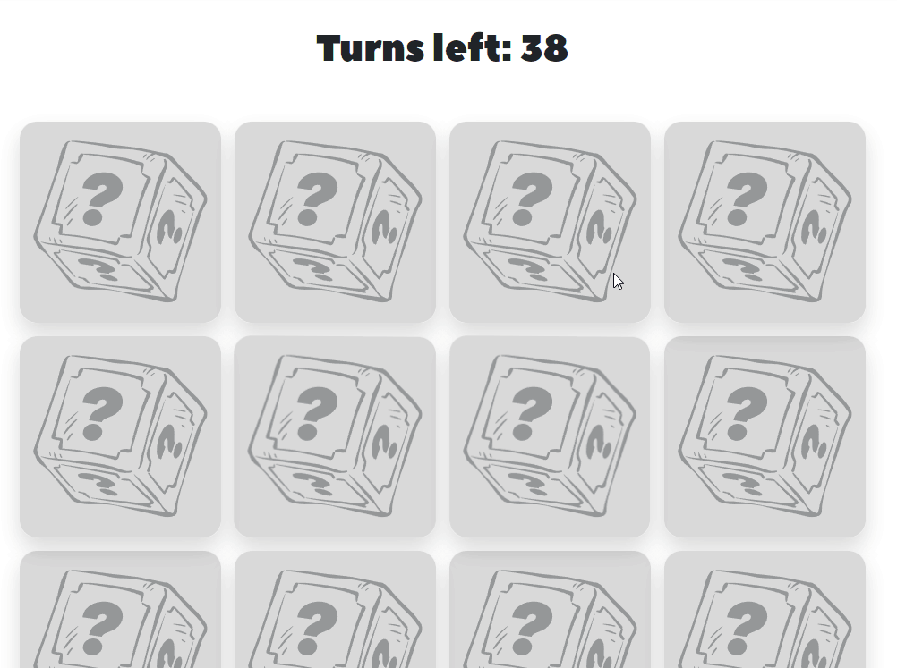
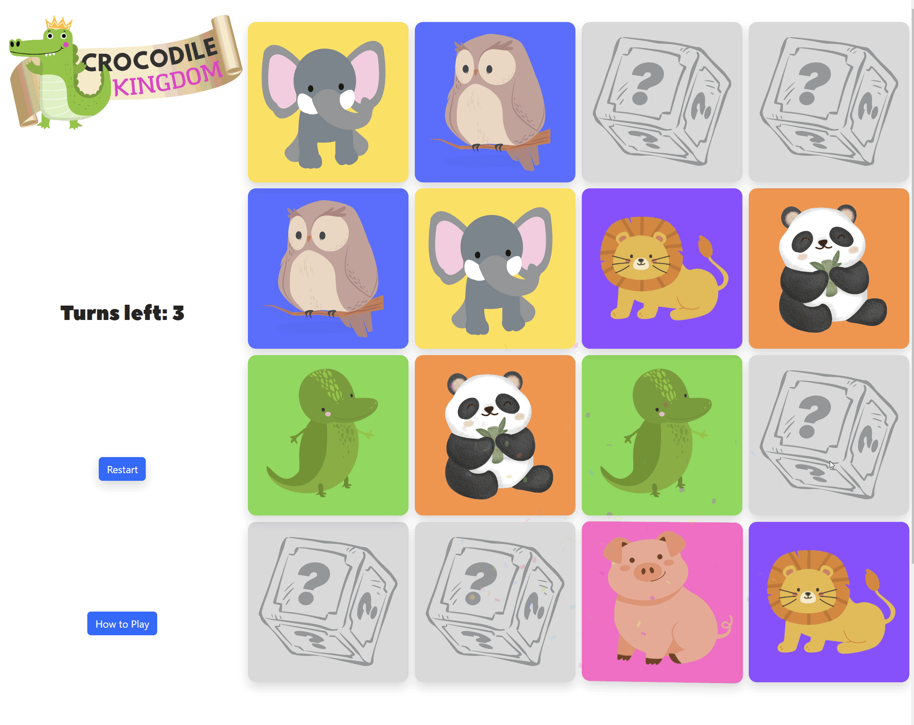
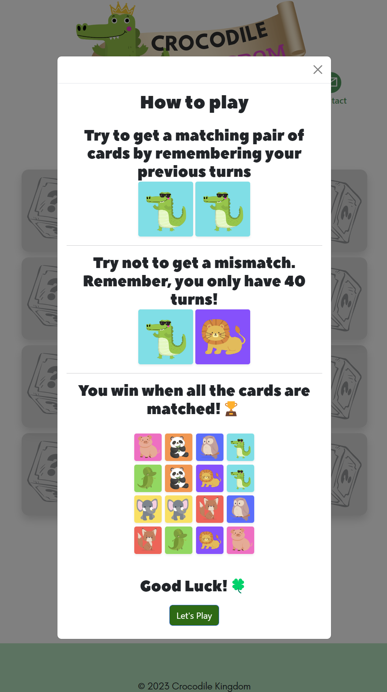
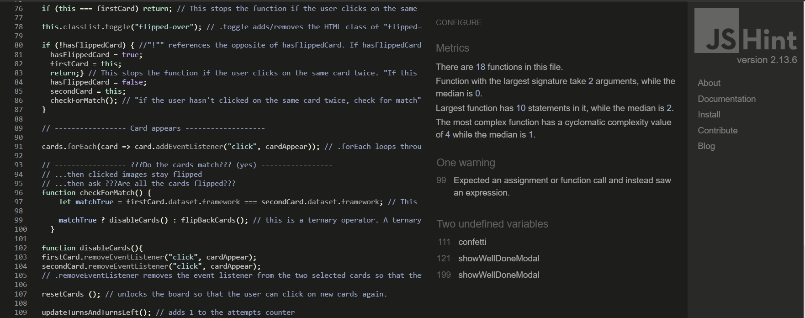
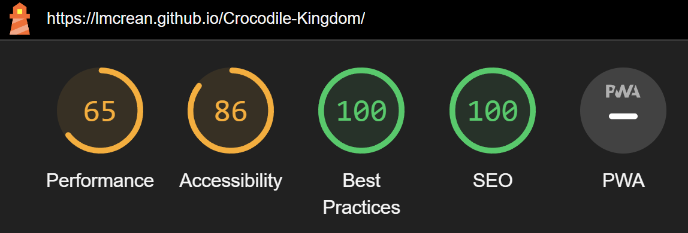
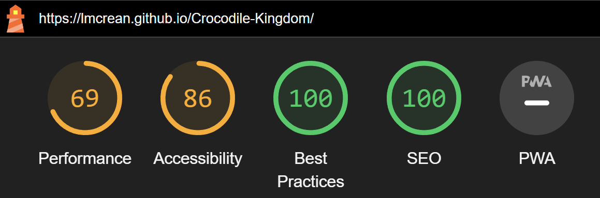

<div align="center">


#  Memory Game with JavaScript <!-- omit in toc -->

[](https://lmcrean.github.io/Crocodile-Kingdom/) [](https://github.com/lmcrean/Crocodile-Kingdom/blob/main/issues.md) [](https://github.com/lmcrean/Crocodile-Kingdom/commits/main)

<br>



<br>

Crocodile Kingdom is an **animal-themed version of the classic children's memory game**, where the player has to try and match pairs of cards together while never turning more than two cards at once. The game challenges the player's memory skills. *The player wins the game when all the cards are flipped.*


</div>

***
This readme introduces the key features of the project, using the framework of the 5 planes of user experience. It summarises key challenges addressed along the way and also provides credits and acknowledgesments at the end.

An issues file is dedicated to a more specific technical account.

In the issues I have logged written, video or screenshot accounts.

## Table of Contents <!-- omit in toc -->

- [1. Features](#1-features)
  - [1.1. Card Deck](#11-card-deck)
  - [1.2. Reacting Crocodile](#12-reacting-crocodile)
  - [1.3. Turns left Count](#13-turns-left-count)
  - [1.4. Restart Button](#14-restart-button)
  - [1.5. You Win feature](#15-you-win-feature)
  - [1.6. You Lose feature](#16-you-lose-feature)
  - [1.7. How to play feature](#17-how-to-play-feature)
  - [1.8. Floating buttons header](#18-floating-buttons-header)
  - [1.9. Footer](#19-footer)
- [2. UX Development Planes \& Manual Testing](#2-ux-development-planes--manual-testing)
  - [2.1. Strategy Plane](#21-strategy-plane)
    - [2.1.1. Developer Research](#211-developer-research)
    - [2.1.2. Initial Product Research](#212-initial-product-research)
    - [2.1.3. Project Timeline](#213-project-timeline)
    - [2.1.4. Business Strategy \& User Stories](#214-business-strategy--user-stories)
  - [2.2. Scope plane](#22-scope-plane)
    - [2.2.1. Scope Strategy](#221-scope-strategy)
    - [2.2.2. Mininum Viable Product features](#222-mininum-viable-product-features)
    - [2.2.3. Unique Selling Point features](#223-unique-selling-point-features)
    - [2.2.4. Scope of Features](#224-scope-of-features)
  - [2.3. Structure Plane](#23-structure-plane)
    - [2.3.1. Card Deck structure](#231-card-deck-structure)
    - [2.3.2. Turn count structure](#232-turn-count-structure)
    - [2.3.3. Restart button structure](#233-restart-button-structure)
    - [2.3.4. Well done feature structure](#234-well-done-feature-structure)
    - [2.3.5. How To Play structure](#235-how-to-play-structure)
    - [2.3.6. Navbar structure](#236-navbar-structure)
    - [2.3.7. Footer structure](#237-footer-structure)
  - [2.4. Skeleton Plane](#24-skeleton-plane)
    - [2.4.1. Main Page Skeleton:](#241-main-page-skeleton)
    - [2.4.2. How to play Skeleton:](#242-how-to-play-skeleton)
    - [2.4.3. Well done Skeleton:](#243-well-done-skeleton)
    - [2.4.4. You Lose Skeleton:](#244-you-lose-skeleton)
    - [2.4.5. Scale solutions](#245-scale-solutions)
  - [2.5. Surface Plane](#25-surface-plane)
    - [2.5.1. Typefaces Surface](#251-typefaces-surface)
    - [2.5.2. Color surface](#252-color-surface)
    - [2.5.3. Logo Surface](#253-logo-surface)
    - [2.5.4. Card Deck Surface](#254-card-deck-surface)
    - [2.5.5. Button Surface](#255-button-surface)
- [3. Automatic Testing](#3-automatic-testing)
  - [3.1. HTML/CSS/JS Validator Testing](#31-htmlcssjs-validator-testing)
  - [3.2. Lighthouse Report](#32-lighthouse-report)
  - [3.3. Browserstack Testing](#33-browserstack-testing)
- [4. Deployment](#4-deployment)
- [5. Issues and Bugs](#5-issues-and-bugs)
- [6. Credits \& Acknowledgements](#6-credits--acknowledgements)
  - [6.1. Code snippets](#61-code-snippets)
  - [6.2. Stack Overflow and indirect support](#62-stack-overflow-and-indirect-support)
  - [6.3. Technologies Used](#63-technologies-used)
  - [6.4. Acknowledgements](#64-acknowledgements)

***
<div align="center">

# 1. Features

## 1.1. Card Deck
<a src="assets/media/issues/1.1.5.mp4"></a></div>

The Card Deck functions as the classic Memory Game, where the player has to try and match pairs of cards together while never turning more than two cards at once. The game challenges the player's memory skills. *The player wins the game when all the cards are flipped.*
- As the player turns the cards, the logic checks if there's a match or not.
- As the player turns the cards, the rest of the board is temporarily locked so the player can't cheat.
- When the player gets a match, those cards stay flipped over and locked.
- When the player gets a mismatch, the cards flip back over after 2 seconds.

***
<i>

Using embedded JS functions, the card deck is connected to other features
- When the player gets a match,
  - confetti appears to encourage the player.
  - The crocodile mascot reacts with a happy face.
  - a positive sound effect plays
  - turns count count decreases by 1
- When the player gets a mismatch,
  - the crocodile mascot reacts with a suprised face.
  - a negative sound effect plays
  - the turn count decreases by 1
- When the player matches all 8 sets of cards, the You Win modal appears.
</i>
***
## 1.2. Reacting Crocodile



The crocodile reacts to the player's actions. 
- He is happy when the player gets a match.
- He is suprised when the player gets a mismatch.

***
## 1.3. Turns left Count


- The turns start at 40, and count down each time the player attempts to get a match
- When the player reaches 40 turns, the you lose modal appears.

***

## 1.4. Restart Button 


When the player clicks on the restart button, the following happens:
- all cards flip back over
- all cards are shuffled

The restart button is also embedded in the You Win and You Lose feature.

***

## 1.5. You Win feature


When all the cards are flipped, the You Win modal appears. It displays the number of turns taken and remaining, and a restart button. It uses the wording "well done" to encourage the player.

***

## 1.6. You Lose feature


When turns run out to 0, the You Lost modal appears.

The feature provides a restart button, and uses the wording to encourage the player to try again.

***

## 1.7. How to play feature



The How to play feature explains the rules of the game. 

- it uses the Fisher Yates algorthim to shuffle the cards in the demo.


***

## 1.8. Floating buttons header


The floating buttons header contains a music button, a sound effect button, and a contact button. 

### 1.8.1. SFX button <!-- omit in toc -->


The sound effect button starts on mute, and the player can choose to turn them on.

SFX are included for the following events:
- when the player clicks on a card
- when the player gets a match
- when the player gets a mismatch
- when the player wins the game
- when the player loses the game

The SFX button animates.


### 1.8.2. Music button <!-- omit in toc -->


The music button starts on mute, and the player can choose to turn it on.

It plays a loop of relaxing music that 5 year olds might enjoy.

The music button animated just like the SFX button.

### 1.8.3. Contact button <!-- omit in toc -->


The contact button opens a new tab using mailto:.

## 1.9. Footer


There is a footer with social media links, all of which open in a new tab.

[↑ Back to top](#Portfolio-Project-2-with-Javascript)

***

</div>

# 2. UX Development Planes & Manual Testing

**The 5 UX development planes were used as an efficient framework for documenting the project's intentions.** 

- The Strategy plane set the intention of a children's memory game with Vanilla Javascript that would be developed over 6 weeks.
 - The Scope plane identified a range of Mininum Viable Product and Unique Selling Point features.
 - The Structure plane connected the features with efficient logic for playing the memory game.
 - The Skeleton plane was developed for a responsive layout, allowing the game to be played on all mainstream devices.
 - The Surface plane intended to be a fun, engaging and accessible design for children.


**Manual testing focused on the functionality of the JS logic and CSS visuals:**

Using the latter 3 UX Planes as a guideline:
- **For the Structure plane, JS logic and HTML hyperlinks** functionality within each feature, using console.log() to check that the code was running as expected.
- **For the Skeleton plane, CSS positioning and responsivity to viewport width**, key breakpoints being at mobile view, tablet view (768px), laptop view (1208px) and desktop view (1728px+). 
- **For the Surface plane, design choices through vector graphics, typography, color and sound** that serve the user stories and elicit a positive emotional response. CSS was the key programming language and Canva was used for rendering graphic illustrations.


## 2.1. Strategy Plane

The overall strategy was to develop a memory game over 6 weeks that would appeal to 5 year olds.

**the developer chose to create a memory game**
  - it had lots of resources available, making it achievable in the time frame
  - it offered front-end opportunities with Javascript

### 2.1.1. Developer Research

<details>
<summary>
The developer researched these areas of the Comparitative programming:</summary>

- Variables. In Javascript, variables are used to store data values. Variables are declared with the ```var``` keyword. The ```=``` sign is used to assign values to variables. In this project.
- Core Data types, such as **strings**, **float** or real, **integers**, **booleans**. In some situations undefined or null is appropriate.
- Operators. In Javascript, operators are used to assign values, compare values, perform arithmetic operations. In this project.
- Truthy and Falsy. In Javascript, a falsy value is a value that is considered false when encountered in a Boolean context. 
- Flow control and iteration. 
  - If() statements, when they are used without an else statement, are known as "one-way" conditionals because they only execute when the condition is true.
  - ternary conditional statements, which are a shorthand version of if() statements.
- Data Structures. In comparatitative programming, data structures are used to store and organize data. In this project, and for Javascript arrays are often used. Arrays are used to store multiple values in a single variable. On a more challenging level, arrays can be used to store objects, which are more complex data structures.
- Manipulating data structures. An example would be adding points to a scoreboard, or displaying a countdown timer.
- Functions. In comparitative programming, functions are used to perform a specific task. In this project, functions were used to navigate the database, and to display the data in the DOM.
- Classes. In comparitative programming, classes are used to create objects for example a class of "car" could have the properties of "colour", "make", "model", "year". Classes can interact with each other, for example a class of "car" could have a method of "drive" which would interact with the class of "engine". In this project, classes could be used to create objects, such as the "quiz" class, which had the properties of "question", "answer", "choices", "correct answer", "image", "explanation".

</details>
<br>
<details>
<summary>The Developer then researched these areas of the Javascript:</summary>

- var, let and const variables. In Javascript, variables are used to store data values. Variables are declared with the ```var``` keyword. The ```=``` sign is used to assign values to variables. In this project.
- $ symbol. In Javascript, the $ symbol is used to select an element from the DOM. In this project, the $ symbol was used to select the elements from the DOM, and to manipulate the elements.
- String methods for manipulating strings
- The DOM. The DOM represents the page so that programs can change the document structure, style, and content.
  </details>

<br>

The Developer then tested a [walkthrough project of a memory game](https://github.com/code-sketch/memory-game), using event listeners, functions, loops, arrays, objects, and DOM manipulation.

[↑ Back to top](#Portfolio-Project-2-with-Javascript)

### 2.1.2. Initial Product Research
This project had the intentional advantage of plenty existing resources of high relevance. 

The following resources and repositories were researched. 

- [Memory Game](https://github.com/code-sketch/memory-game) by code-sketch  with [Walkthrough](https://marina-ferreira.github.io/tutorials/js/memory-game/), [Demo](https://marina-ferreira.github.io/projects/js/memory-game/), [Video tutorial](https://www.youtube.com/watch?v=eMhiMsEC9Uk&list=PLLX1I3KXZ-YH-woTgiCfONMya39-Ty8qw) 
  - This a particularly well documented resource and most similar to what the developer was trying to achieve.
  - the tutorial offers step by step guidance on how to build the game.
 - [Alien Memory Game](https://github.com/moirahartigan/Portfolio-2---Alien-Memory-Game) by Github player: moirahartigan
- [Memory Game](https://github.com/flowforfrank/memory-game) by flowforfrank, with [tutorial article](https://webtips.dev/memory-game-in-javascript)
- [30 minute walkthrough tutorial](https://www.youtube.com/watch?v=bznJPt4t_4s) by dcode
- [Article](https://www.codewithfaraz.com/content/112/creating-flip-card-memory-game-with-html-css-and-javascript) by codewithfiraz.com explaining the role of each CSS class and JS function
- https://codepen.io/WebDevSimplified/pen/EdEjyx had a use of flip counter and a fun couuntdown timer

It was crucial for this project to choose a memory game that was achievable in the time frame, and that had a lot of resources available.

[↑ Back to top](#Portfolio-Project-2-with-Javascript)

### 2.1.3. Project Timeline

The 6 week timeline for the project was as follows: 


**Week 1: 31st July to Sunday 6th August:** 

- Researching theory around Javascript Language, low-stakes practise such as coding challenges.
- Practising Mock Projects via Code Institute and other resources
- Established the concept of a memory game.

**Week 2: 7th to Sunday 13th August:**  

- Practising Mock Projects via Code Institute and other resources
- UX Strategy, Scope, Structure completed.
- Figma Wireframe  
- Finding a database to use. 

**Week 3: 14th to Sunday 20th August** 

- Designing HTML links, using broad classes for easy styling.
- Designing CSS with a mobile-first approach, using Figma wireframe as a guide, and using ```clamp()```, ```media  queries``` function to make the website responsive to viewport width.
- Designing Javascript to navigate the database

**Week 4: 21st to Sunday 27th August:** 

- SFX Feature
- Modals
- Mininum Viable Product completed
- Confetti Feature


**Week 5: 28th August to Sunday 3rd September:** 

- Animated Crocodile Feature
- Scoreboard
- Fixing bugs

**Week 6: 5th to Saturday 9th:** 

- Surface Design Tweaks
- Documentation

The project was completed on Saturday 9th September 2023.

[↑ Back to top](#Portfolio-Project-2-with-Javascript)

### 2.1.4. Business Strategy & User Stories

The business goals were to create a simple memory game that was fun and engaging for the player. The target audience was 5 year olds, and it could be assumed that they have never played a memory game before.

<div align="center"><h3> User Stories testing</h3>


 </div>


  
  **As a player, I need to an engaging feedback loop that suggests how I'm doing as I play the game.**<i>
  - *the turn's left feature counts down after each turn*
    - when they player reaches 0 turns, the you lost modal appears
  -  *if there's a match...*
     -  *the cards stay flipped over, allowing the player to see how many turns remain*
     -  *confetti appears when the player gets a match*
     -  *a positive "bell chime" plays*
     -  the crocodile reacts with a happy face
  -  *if there's a mismatch...*
     -  *the cards flip back after a moment*
     -  *a buzz sound effect plays*
     -  the crocodile reacts with a suprised face
  - *when the player wins...*
    - a well done message appears with a trophy icon
    - a celebratory sound effect plays
  - *when the player loses...*
    - a you lost message appears with a sad crocodile icon
    - a sad sound effect plays
</i>

**As a player, I need to understand how to play the game.**
  - *there is a how to play feature that explains the rules of the game.*
  - *it includes engaging graphics*  


**As a player, I need the game to be accessible and easy to read**.<i>
- *there is a card deck with 16 cards that display randomly.*
- *sound effects are included, they start turned off and the player can adjust if they want to*
- the fonts chosen are easy to read
</i>

**As a player, I need the tone of the design to appear warm, entertaining and encouraging.**
  - *The colors used are bright* 
  - *friendly vector illustrations*
  - *confetti appears as the player gets a match*
  - *there are various friendly sound effects mentioned in the first "feedback loop" User Story*

**As a player, I need to recieve different levels of praise for engaging with and completing the game.**
   -  *confetti appears when the player gets a match*
   -  *a well done message appears when the player wins the game*

**As a player, I need an engaging level of challenge**
  - *The card deck shuffles each time the player restarts the game*
  - *the player is told their previous score and is encouraged to beat it*

**As a player, I want to be able to contact the business if I have any questions, as well as share the game easily with my friends.**
  - *A footer is displayed at the bottom of the page, with a mailto link that .*
  - *a contact button is displayed at the top of the page, with a mailto link that opens in a new tab*

***

## 2.2. Scope plane

For the scope plane, the developer drafted a mininum viable product that informed a scope of features designed to meet the needs of new players.

A mininum viable product is a product with just enough features to satisfy early customers, and to provide feedback for future development. 

[↑ Back to top](#Portfolio-Project-2-with-Javascript)

### 2.2.1. Scope Strategy

It was important to choose a project that was achievable in the time frame, and that had a lot of resources available.

The project was researched, conceived and designed in 6 weeks. Important limitations of the project had to be set from the outset such as
- **choosing a "well-trodden" path that had lots of tutorials and resources available.** This was to ensure that the project was achievable in the time frame, and that the developer could learn from the resources available.
- **using a simple open-source database that already existed for the JavaScript to navigate**, e.g. pop quiz trivia data, personality test data. Inventing datasets risked distracting from the front-end design and JavaScript functionality.
- **Developing the Mininum Viable Product and Unique Selling Point simultaeneously.** This way, the essential product would be met in time with the deadline, and the unique features would keep me motivated.

[↑ Back to top](#Portfolio-Project-2-with-Javascript)

### 2.2.2. Mininum Viable Product features

<i>
The minumum viable product of the memory game was

- A card Deck:
  - to use 16 cards that displayed randomly
  - the cards needed to flip back after a 2 second delay if they were a mismatch
  - the cards needed to stay flipped if they were a match
- Turn's left count
- Restart button
- A congratulations message when the game was completed
- a how to play feature
- a logo and a contact button
</i>

### 2.2.3. Unique Selling Point features

<i>
- Confetti
- Sound effects
- Music
- Animated Crocodile
- Animations
- a footer with social media links
</i>

[↑ Back to top](#Portfolio-Project-2-with-Javascript)


### 2.2.4. Scope of Features
The following features were designed to meet the needs of new playerssometimes appearing more than once for the purpose of both making the website easy to navigate and consistent branding design.

The full scope and function of features is discussed in the opening [Features](#1-features) section.

[↑ Back to top](#Portfolio-Project-2-with-Javascript)

## 2.3. Structure Plane

This Structure plane summarises the structure of each feature by highlighting most essential HTML, CSS and JS functions for the feature to work. The developer also used this as a workflow for drafting in the features.

### 2.3.1. Card Deck structure

<a src="assets/media/issues/1.1.5.mp4"></a>

<i>"As a player, I need the design to be accessible, easy to read with lots of visuals. As a player, I need the tone of the design to appear warm, entertaining and encouraging."</i>

JS:
The flowchart below illustrates the logic of the card deck.


START computer spawn cards, turns starts at 0:


```CSS grid``` was used here.

**player clicks on first image, card appears:**


CSS:

```css

.card-item-container {
  transform: scale(1);
  transform-style: preserve-3d;
  transition: transform 0.5s ease-in-out; 
}

.card-item-container:active {/*selects front and back of cards when clicked*/
  transform: scale(.90);
  transition: transform .2s;
  }

.card-item-container.flipped-over {
  transform: rotateY(180deg);
  backface-visibility: hidden;
}

.card-item {/*selects front and back of cards*/
transition: transform 0.5s ease-in-out; 
transform: scale(1);
}

.card-front {
transform: rotateY(180deg);
}
```

JS Code:

```js
// ----------------- player Clicks on 1st card -----------------

const cards = document.querySelectorAll(".card-item-container");

cards.forEach(card => card.addEventListener("click", cardAppear));

// Card appears this function flips both the front of the card and the back of the card, due to the CSS rule of backface-visibility, the front of the card becomes visible and the back of the card becomes invisible.

function cardAppear() { 
this.classList.toggle("flipped-over"); // .toggle adds/removes the class of "flipped-over" on the card that it is clicked on.
}
```

- player clicks on second image, card appears, +1 to turns:


- Do the cards match? (no), clicked images flipped back after 2 seconds:


- Do the cards match? (yes), clicked images stay flipped:


- Are all the cards flipped? (no), go back to player clicks on first image.


- Are all the cards flipped? (yes), go to you've won feature.

**Video 1 with cards shuffled correctly:**

<a src="assets/media/issues/1.1.5.mp4"></a>

**Video 2 presents fresh shuffle:**

<a src="assets/media/issues/1.1.5b.mp4"></a>

[↑ Back to top](#Portfolio-Project-2-with-Javascript)

### 2.3.2. Turn count structure


<i>"As a player, I need a quick feedback loop that suggests how I'm doing as I play the game."</i>

HTML:
```html
<section id="score-count">
  <h2 class="attempts-count">Turns: <span id="attempts">0</span></h2>
</section>
```

JS:
Establishing the variables **with getElementById**:

```js
const attemptsContainer = document.getElementById("attempts"); // This variable selects the attempts class from the HTML, which is used to display the number of attempts the player has taken. It has started at 0.
```

```js
let attemptsCount = 0;  // attempts starts at 0
```

establishing the function:

```js
 //attempts counter
attemptsCount = 0;
 
function plusOneAttempts() {
  let oldAttempt = parseInt(attemptsContainer.innerText);
  attemptsContainer.innerText = ++oldAttempt;
}
```

add ```plusOneAttempts ();``` inside the end of ```disableCards()``` and ```flipBackCards()``` :

```js
function disableCards(){
firstCard.removeEventListener("click", cardAppear);
secondCard.removeEventListener("click", cardAppear);
// .removeEventListener removes the event listener from the two selected cards so that they can't be clicked again.})

resetCards (); // unlocks the board so that the player can click on new cards again.

plusOneAttempts(); // adds 1 to the attempts counter

}
```

```js
function flipBackCards() {
  lockCards = true; // This statement is set to true so that the player can't click on more than 2 cards at a time.

setTimeout(() => {
  firstCard.classList.remove("flipped-over");
  secondCard.classList.remove("flipped-over"); // removes the HTML class of "flipped-over" on the card that it is clicked on. This flips the card back over.
  resetCards (); // unlocks the cards so that the player can click on them again.
  },
  2000); // This sets a timer of 2 seconds before the cards flip back over.

  plusOneAttempts(); // adds 1 to the attempts counter
}
```


### 2.3.3. Restart button structure


<i>"As a player, I need a new arrangement of cards each time I play the game to keep it interesting."</i>

HTML:

```html
<button class="btn btn-primary rounded-corner shadow" id="restart-button">Restart</button>
```

JS:
```js
function restartGame() {
  cards.forEach(card => card.classList.remove("flipped-over")); // This removes the HTML class of "flipped-over" from all cards, flipping them back over.

  cards.forEach(card => card.addEventListener("click", cardAppear)); // This adds an event listener to each card, as well as restores the "click" event listener from disablecards function (used to disable cards when the cards match). When the card is clicked, the function cardAppear is run and the card is flipped.

  setTimeout (() => { // This sets a timer of just over 0.5 seconds before the cards flip back over, without this function, the player would be able to see the flipped over cards get assigned to their secret position.
  shuffleCardsAgain (); // This reshuffles the cards.
  }, 550);
  
  resetCards (); // This resets the variables to their original values.
  attemptsContainer.innerText = 0; // This resets the attempts counter to 0. 

  lockCards = false; // This statement is set to false so that the player can click on the cards again.
}
```

### 2.3.4. Well done feature structure 


<i>"As a player, I need to receive praise for completing the game."</i>

HTML:
```html
<div class="modal fade  " id="well-done-modal" tabindex="-1" aria-labelledby="exampleModalLabel" aria-hidden="true">
  <div class="modal-dialog modal-dialog-centered">
    <div class="modal-content">
      ...
      </div>
      </div>
      </div>
```

The constant ```wellDoneModal``` is established with ```const wellDoneModal = document.getElementById("well-done-modal");```

The well done modal is activated within the ```disableCards()``` function, when the player has flipped all the cards. 

```js
function disableCards(){
firstCard.removeEventListener("click", cardAppear);
secondCard.removeEventListener("click", cardAppear);
// .removeEventListener removes the event listener from the two selected cards so that they can't be clicked again.})

resetCards (); // unlocks the board so that the player can click on new cards again.

plusOneAttempts(); // adds 1 to the attempts counter

// Check if all cards are matched
if (document.querySelectorAll(".flipped-over").length === cards.length) {
// All cards are matched, so show the well-done modal
showWellDoneModal();
}
}
```

The ```showWellDoneModal()``` function is established:

```js
showWellDoneModal = () => {
  document.getElementsByClassName("well-done-modal")[0].click();  console.log("showWellDoneModal"); //This function opens the well done modal box, by clicking the HTML button with the class of "well-done-modal".
}
```

There is also an ```updateTurnsAndTurnsLeft()``` function that is used to display the score count in the well done modal:

```js
function updateTurnsAndTurnsLeft() {
  let oldAttempt = parseInt(turnsContainer.innerText);
  turnsContainer.innerText = ++oldAttempt; // This adds 1 to the attempts counter.
  let oldTurnsLeft = parseInt(turnsLeftContainer.innerText);
  turnsLeftContainer.innerText = --oldTurnsLeft; // This subtracts 1 from the "attempts left" counter.

  turnsModalContainer.textContent = turnsContainer.textContent; // This updates the turns modal box with the number of attempts the player has taken.
  turnsLeftModalContainer.textContent = turnsLeftContainer.textContent; // This updates the turns left modal box with the number of attempts the player has left.
}
```

Resources consulted:
- https://www.w3schools.com/bootstrap/bootstrap_modal.asp#:~:text=To%20trigger%20the%20modal%20window,the%20id%20of%20the%20modal
- https://stackoverflow.com/questions/17144459/javascript-automatically-clicking-a-button


### 2.3.5. How To Play structure 


<i>"As a player, I need to understand how to play the game."</i>

### 2.3.6. Navbar structure 


<i>"As a player, I need the tone of the design to appear warm, entertaining and encouraging."</i>

### 2.3.7. Footer structure


<i>"I want to be able to contact the business if I have any questions, and share the game easily with my friends."</i>


xxxxxxxxx

[↑ Back to top](#Portfolio-Project-2-with-Javascript)

***

## 2.4. Skeleton Plane

The skeleton plane covers the layout of the website, and the responsiveness to viewport width.

**The skeleton plane in this project was intended to be simple and efficient using only 1-2 columns.**

**The skeleton plane was first designed with figma to emphasise a simple and efficient responsive design.**  The design used CSS ```display: grid``` to arrange all elements:

<div align="center">

### 2.4.1. Main Page Skeleton:


Currently the main page switches between 2 views with 1 and 2 columns respectively, depending on the viewport width.

Using amiresponsive tool:


<details><summary>Click here to view Devtools inspection:</summary>
</details>

<details><summary>Click here to view initial Figma wireframe:</summary>
</details><br><br>
</div>
<i>

- Mobile design used 1 column and arranged all the elements vertically. 
  - The deck of cards were also displayed in a 4x4 subgrid. 
- Desktop Design split the page into 2 columns,  
  - with the card deck on the right, taking up the screen space, 
  - the footer taking up both columns hiding underneath the card deck.
  - the remaining features were arranged in the left column in various rows, with a right-aligned position.
  </i>


to make the design responsive, the following CSS functions were used with ```grid-template-areas``` to indicate the position of each element:

```css
.gameplay-display-grid {
  display: grid;
  grid-template-columns: 1fr;
  grid-template-rows: auto;
  grid-template-areas: 
    "logo"
    "turns-count"
    "cards"
    "restart"
    "how-to-play"
    "footer";
}

  #logo-desktop {grid-area: logo;}
  #card-deck {grid-area: cards;}
  #turns-left-section {grid-area: turns-count;}
  #restart-section {grid-area: restart;}
  #how-to-play {grid-area: how-to-play;}
  #footer-desktop-display {grid-area: footer;}

@media screen and (min-width: 1208px) {
.gameplay-display-grid {
  display: grid;
  grid-template-columns: 1fr 1fr;
  grid-template-rows: auto;
  grid-template-areas: 
    "logo cards"
    "turns-count cards"
    "restart cards"
    "how-to-play cards"
    "footer footer";
}

  #logo-desktop {grid-area: logo; margin: 0px auto;}
  #card-deck {grid-area: cards;}
  #turns-left-section {grid-area: turns-count;}
  #restart-section {grid-area: restart;}
  #how-to-play {grid-area: how-to-play;}
  #footer-desktop-display {grid-area: footer;}
}
```


<br><br>
<div align="center"> 

### 2.4.2. How to play Skeleton:

current state: a simple portrait view that fills mobile to desktop screen sizes.


<details>
<summary>Click here to view the Figma wireframe:</summary>


</details>


</div>

The How To Play feature was a simple modal pop-up that would show an animated gif of how to play the game. The other content would fade out when the modal was activated.
- Mobile design used 1 column and arranged all the elements vertically inside a container with ```position: absolute``` 
- Desktop design split the page into 2 columns, with the animated tutorial in the left column, and the remaining content in the right column.


<div align="center"> 

### 2.4.3. Well done Skeleton:

<details>
<summary>Click here to view the Well Done wireframe:</summary>
</details>

</div>

The Well Done feature was a simple modal pop-up that would show a Well done title, a summary of score count, and a play again button. The other content would fade out when the modal was activated. 
- The well done feature would **reuse**
  - ```display: grid``` from How to play Feature
  - the modal pop-up formula
  - the score count formula
  - the restart button 
- Mobile design used 1 column and arranged all the elements vertically inside a container with ```position: absolute``` 
- Desktop design split the page into 2 columns, with the well done in the left column, and the remaining content in the right column.

current state: a simple portrait view that fills mobile to desktop screen sizes.


[↑ Back to top](#Portfolio-Project-2-with-Javascript)

### 2.4.4. You Lose Skeleton:

current state: a simple portrait view that fills mobile to desktop screen sizes.


[↑ Back to top](#Portfolio-Project-2-with-Javascript)

### 2.4.5. Scale solutions
Regarding font-size, the ```clamp()``` function was mostly used to ensure the font size was responsive to the device size. This was used instead of media queries, as it was more efficient and easier to read, it allowed the media queries to be used more for positioning and to address bugs with the display.

```css
/* The clamp() CSS function clamps a value between an upper and lower bound. It takes three parameters: a minimum value, a preferred value, and a maximum allowed value. [...]*/
h1 { font-size: clamp(1.8rem, 1.3893rem + 2.3467vw, 4rem);}
h2 { font-size: clamp(1.5rem, 1.5rem + 1.2vw, 2.5rem); }
p, h3,h4,h5 { font-size: clamp(1rem, 0.9253rem + 0.4267vw, 1.4rem);}
```
[↑ Back to top](#Portfolio-Project-2-with-Javascript)

## 2.5. Surface Plane
This surface plane describes the choice of typefaces, colors and style themes relevant to the project's desired tone and practical needs.

[↑ Back to top](#Portfolio-Project-2-with-Javascript)


### 2.5.1. Typefaces Surface

Typefaces used were xxxxxxxxxxxxxxxxxxxxxxxxx for headings and xxxxxxxxxxxxxxxxxxxxxx for body text. The font pairings were chosen for their playful  but professional tone as outlined in the strategy plane.


[↑ Back to top](#Portfolio-Project-2-with-Javascript)

xxxxxxxxxxxxxxxx
```css
/*These type selectors are all Peace Sans*/
h1, h2 {
  font-family: 'PeaceSans', sans-serif;
}

/* These type selectors are all Glacial Indifference*/
p, h3, h4, h5, a,
form input{
  font-family: 'glacialindifference', sans-serif;
}

/* these type selectors are all Glacial Indifference, but with some small changes in style*/
h3 {font-weight: 700 !important; /*bolden text*/}
h4 {font-style:italic;/*italicize text*/}
h5 {font-size: 0.7rem;/*reduce font size*/}
```
***
The color theme was chosen to be consistent with the logo with the aim of creating a consistent brand identity. To speed up efficiency, root variables were used to store the color values. This also allowed the color theme to be changed easily in the future.

[↑ Back to top](#Portfolio-Project-2-with-Javascript)

### 2.5.2. Color surface

the root variables were established in the ```:root selector:```


### 2.5.3. Logo Surface


The logo was designed with simple colors with Canva Open Source imagery. The logo was designed to be simple and easy to read, with a friendly crocodile character.

[↑ Back to top](#Portfolio-Project-2-with-Javascript)

### 2.5.4. Card Deck Surface

The card deck used an animal theme, as a way to be appealing for children.

|||||
|----|----|----|----|
|||||

The back of the card included a box with question marks, with diagonal lines to indicate excitement.


<br><br>

```drop-shadow``` and ```rounded corners``` were added to the cards to make them appear more 3D.


[↑ Back to top](#Portfolio-Project-2-with-Javascript)


### 2.5.5. Button Surface

The header and footer buttons used circle motifs, using a faded green from the ```root``` selectors..

The gameplay buttons used a rounded rectangle motif, using a faded green from the ```root``` selectors.


[↑ Back to top](#Portfolio-Project-2-with-Javascript)


# 3. Automatic Testing

The Automatic Testing achieved
* use lighthouse testing to identify files that could be resized and accessibility that can be improved.
* a good lighthouse testing score, particularly for performance, accessibility, best practices.
* Passed W3C Validator Testing for both HTML5 and CSS3, thereby removing excess code and broken links.
* Confirmed was working as expected on major browser's and devices.

[↑ Back to top](#Portfolio-Project-2-with-Javascript)

## 3.1. HTML/CSS/JS Validator Testing

The W3C Markup Validator and W3C CSS Validator Services were used to validate the project to ensure there were no syntax errors in the project.

The result was <b> passed </b> for HTML5, CSS3 and JS.




[↑ Back to top](#Portfolio-Project-2-with-Javascript)

## 3.2. Lighthouse Report

To check the lighthouse report on a chrome browser, right click inspect and click on the lighthouse tab. The lighthouse report was run on the home page, features page and sign up page.

To further improve the lighthouse score I could use more WebP images and reduce image sizes.

| | Home Page |
|---|---|
| Mobile |   |  | 
| Desktop | |  | 
|Timestamp| 25/8/2023 | 31st July '23 | 15th July '23 |

[↑ Back to top](#Portfolio-Project-2-with-Javascript)

## 3.3. Browserstack Testing


xxxxxxxxxxxxxxxxxxxxxxxxxxxxxxxxxxxxxxxxxxxxxxxxxxxxxxxxxxxxxxxxxxxxxxxxxxxxxxxxxxxxxxxxxxxxxxxxxxxxxxxxxxxxxxxxxxxxxxxxxxxxxxxxx

[↑ Back to top](#Portfolio-Project-2-with-Javascript)


# 4. Deployment
The site was deployed to GitHub pages. You can access the live link here: [https://lmcrean.github.io/Crocodile-Kingdom](https://lmcrean.github.io/Crocodile-Kingdom).

To deploy on Github pages, the following steps were taken:

1. Log in to GitHub and locate the GitHub Repository
2. Go to the settings tab
3. Go to the GitHub Pages section
4. Go to the Source section and select the Master Branch
5. Once the page has refreshed, scroll back down to the GitHub Pages section to locate the now published site link

To fork the repository:
1. Log in to GitHub and locate the GitHub Repository
2. At the top of the Repository, on the right side of the page, select "Fork"
3. You should now have a copy of the original repository in your GitHub account, and you can deploy it to GitHub pages following the steps above


[↑ Back to top](#Portfolio-Project-2-with-Javascript)

# 5. Issues and Bugs

[](https://github.com/lmcrean/Crocodile-Kingdom/blob/main/issues.md)

Fixed issues and bugs are documented in a seperate file called [issues.md](issues.md).

[↑ Back to top](#Portfolio-Project-2-with-Javascript)

# 6. Credits & Acknowledgements

## 6.1. Code snippets

The following code snippets were used and adapted in the project:

- [Code-sketch's step by step Memory Game tutorial](https://www.youtube.com/watch?v=ZniVgo8U7ek) for a memory game with flex: display. This was used as a starting point for the project, and was adapted to suit the project's needs.
- [Confetti](https://www.npmjs.com/package/canvas-confetti) by Kiril Vatev was used as a fun feature to celebrate the player's match.
- [Mute / Unmute Button](https://codepen.io/giannisrig/pen/RYJPzb)with Material Design Animation by Giannis Riganas was used to add a mute button to the game.

[↑ Back to top](#Portfolio-Project-2-with-Javascript)

## 6.2. Stack Overflow and indirect support

The following Stack Overflow posts were used to solve issues in the project:

- https://stackoverflow.com/questions/48474/how-do-i-position-one-image-on-top-of-another-in-html helped with arranging the Crocodile sprite with layers on top of each other.


## 6.3. Technologies Used

Languages
[HTML5](https://en.wikipedia.org/wiki/HTML5) was used for the structure and content of the website
[CSS3](https://en.wikipedia.org/wiki/Cascading_Style_Sheets) was used for the styling of the website
[Javascript](https://en.wikipedia.org/wiki/JavaScript) was used for the interactive features of the website

Programmes
[VSCode](https://code.visualstudio.com/) was used as my code editor
[Github](https://www.github.com/) was used for Version control
[Canva](https://www.canva.com/) was used for designing Graphics including the logo
[Figma](https://www.figma.com/)  for Designing wireframe
[Fancy Screen](http://fancyapps.com/) by Janis Skarnelis was used to document GIFs and videos of the project

Libraries
[Node.js](https://nodejs.org/en/) was used to install ```npm``` and run the Confetti feature.
[Bootstrap](https://getbootstrap.com/) was used for the Modal, button features as well as drop-shadow effects
[JQuery](https://jquery.com/) was used for mute button.
[Canva](https://www.canva.com/) was used for sourcing open-source images.


Tools
[Clamp tool](https://clamp.font-size.app/) was used for developing a responsive font size with the clamp tool
[amiresponsive](https://ui.dev/amiresponsive) was used for checking mobile, desktop, tablet view
[browserstack](https://www.browserstack.com/) was used for checking website on firefox, opera, edge, safari and chrome
[Python Tutor](https://www.pythontutor.com) was used for debugging the Javascript, as well as a research tool early on in the project to understand the flow of the code.
[shields.io](https://shields.io/) was used for Documentation Badges


[↑ Back to top](#Portfolio-Project-2-with-Javascript)


## 6.4. Acknowledgements
I'd like to thank to the tutors at Code Institute, who provided week-to-week support throughout the project, and were always available to answer questions and provide guidance.

I'd like to thank Seun Owonikoko, my mentor at Code Institute, for her encouragement and support during our mentoring sessions.

[↑ Back to top](#Portfolio-Project-2-with-Javascript)
