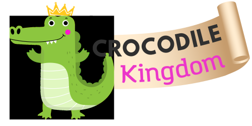

<div align="center">




 

<br>


<br>

# Crocodile Kingdom <!-- omit in toc -->


Crocodile Kingdom is an **animal-themed version of the classic children's memory game**, where the player has to try and match pairs of cards together while never turning more than two cards at once. The game challenges the player's memory skills and is designed for 5 year olds.


</div>

<div align=center></div><br>

This readme introduces the key features of the project, using the framework of the 5 planes of User Experience. It summarises key challenges addressed along the way and also provides credits and acknowledgesments at the end.

An [issues.md](https://github.com/lmcrean/Crocodile-Kingdom/blob/main/issues.md) file is dedicated to the most specific technical account of important issues and bugs that were researched and solved during the project.


<div align=center>

***Navigation Links:***

[](https://lmcrean.github.io/Crocodile-Kingdom/) [](https://github.com/lmcrean/Crocodile-Kingdom/blob/main/issues.md) [](https://github.com/lmcrean/Crocodile-Kingdom/commits/main)

</div>

## Table of Contents: <!-- omit in toc -->

<b>

[1. Outline of Features](#1-outline-of-features)<br>
[2. UX Development Planes & Manual Testing](#2-ux-development-planes--manual-testing)<br>
[3. Automatic Testing](#3-automatic-testing)<br>
[4. Deployment](#4-deployment)<br>
[5. Issues and Bugs](#5-issues-and-bugs)<br>
[6. Credits & Acknowledgements](#6-credits--acknowledgements)

</br>
</b>

***

Full Table of Contents: <!-- omit in toc --></div>

- [1. Outline of Features](#1-outline-of-features)
  - [1.1. Card Deck](#11-card-deck)
  - [1.2. Logo with Reacting Crocodile feature](#12-logo-with-reacting-crocodile-feature)
  - [1.3. Turns left Count](#13-turns-left-count)
  - [1.4. Restart Button](#14-restart-button)
  - [1.5. You Win feature](#15-you-win-feature)
  - [1.6. You Lose feature](#16-you-lose-feature)
  - [1.7. How to play feature](#17-how-to-play-feature)
  - [1.8. Floating buttons header](#18-floating-buttons-header)
  - [1.9. Footer](#19-footer)
  - [1.10. High Score feature](#110-high-score-feature)
- [2. UX Development Planes \& Manual Testing](#2-ux-development-planes--manual-testing)
  - [2.1. Strategy Plane](#21-strategy-plane)
    - [2.1.1. Developer Research](#211-developer-research)
    - [2.1.2. Initial Product Research](#212-initial-product-research)
    - [2.1.3. Project Timeline](#213-project-timeline)
    - [2.1.4. User Stories \& business goals](#214-user-stories--business-goals)
  - [2.2. Scope plane](#22-scope-plane)
    - [2.2.1. Scope Strategy](#221-scope-strategy)
    - [2.2.2. Mininum Viable Product features](#222-mininum-viable-product-features)
    - [2.2.3. Unique Selling Point features](#223-unique-selling-point-features)
    - [2.2.4. Scope of Features](#224-scope-of-features)
  - [2.3. Structure Plane](#23-structure-plane)
    - [2.3.1. Card Deck structure](#231-card-deck-structure)
    - [2.3.2. Turn count structure](#232-turn-count-structure)
    - [2.3.3. Restart button structure](#233-restart-button-structure)
    - [2.3.4. You Win feature structure](#234-you-win-feature-structure)
    - [2.3.5. You Lose Feature Structure](#235-you-lose-feature-structure)
    - [2.3.6. How To Play structure](#236-how-to-play-structure)
    - [2.3.7. Reacting Crocodile structure](#237-reacting-crocodile-structure)
    - [2.3.8. Sound effect structure](#238-sound-effect-structure)
    - [2.3.9. High Score Structure](#239-high-score-structure)
  - [2.4. Skeleton Plane](#24-skeleton-plane)
    - [2.4.1. Main Page Skeleton:](#241-main-page-skeleton)
    - [2.4.2. How to play Skeleton:](#242-how-to-play-skeleton)
    - [2.4.3. Well done Skeleton:](#243-well-done-skeleton)
    - [2.4.4. You Lose Skeleton:](#244-you-lose-skeleton)
    - [2.4.5. Scale solutions](#245-scale-solutions)
  - [2.5. Surface Plane](#25-surface-plane)
    - [2.5.1. Typefaces Surface](#251-typefaces-surface)
    - [2.5.2. Color surface](#252-color-surface)
    - [2.5.3. Logo Surface](#253-logo-surface)
    - [2.5.4. Card Deck Surface](#254-card-deck-surface)
    - [2.5.5. Button Surface](#255-button-surface)
- [3. Automatic Testing](#3-automatic-testing)
  - [3.1. HTML/CSS/JS Validator Testing](#31-htmlcssjs-validator-testing)
  - [3.2. Lighthouse Report](#32-lighthouse-report)
  - [3.3. Browserstack Testing](#33-browserstack-testing)
- [4. Deployment](#4-deployment)
- [5. Issues and Bugs](#5-issues-and-bugs)
- [6. Credits \& Acknowledgements](#6-credits--acknowledgements)
  - [6.1. Code snippets](#61-code-snippets)
  - [6.2. Stack Overflow and indirect support](#62-stack-overflow-and-indirect-support)
  - [6.3. Articles](#63-articles)
  - [6.4. Technologies Used](#64-technologies-used)
  - [6.5. Libraries Used](#65-libraries-used)
  - [6.6. Acknowledgements](#66-acknowledgements)

<div align=center></div>
<div align="center">

# 1. Outline of Features

## 1.1. Card Deck
<a src="assets/media/issues/1.1.5.mp4"></a></div>

The Card Deck functions as the classic Memory Game, where the player has to try and match pairs of cards together while never turning more than two cards at once. *The player wins the game when all the cards are flipped.*
- As the player turns the cards, the logic checks if there's a match or not.
- As the player turns the cards, the rest of the board is temporarily locked so the player can't cheat.
- When the player gets a match, those cards stay flipped over and locked.
- When the player gets a mismatch, the cards flip back over after 2 seconds.

***

<i>

Using embedded JS functions, the card deck is connected to other features
- When the player gets a match,
  - confetti appears to encourage the player.
  - The crocodile mascot reacts with a happy face.
  - a positive sound effect plays
  - turns count count decreases by 1
- When the player gets a mismatch,
  - the crocodile mascot reacts with a suprised face.
  - a negative sound effect plays
  - the turn count decreases by 1
- When the player matches all 8 sets of cards, the You Win modal appears.
</i>

<div align=center>

## 1.2. Logo with Reacting Crocodile feature

</div>

The crocodile reacts to the player's actions, creating an engaging and entertaining effect for the player. 

- When the player gets a match, the crocodile reacts with a happy reaction. 
  - *This reaction is selected from a random array of "Happy" reactions.*
- When the player gets a mismatch, the crocodile reacts with a suprised reaction. 
  - *This reaction is selected from a random array of "Suprised" reactions.*

<div align=center>

## 1.3. Turns left Count
</div>

The player can clearly see how many turns they have left, in a fun and dynamic way.

- The "turns left" starts at 40, and counts downwards each time the player attempts to get a match and misses.
- If all 40 turns are taken, then the you lose modal appears.
- If the player gets a match, they are rewarded by not losing any turn left.
- The "turns left" is visualised with a progress bar.

<div align=center>

## 1.4. Restart Button 
</div>

When the player clicks on the restart button, the following happens:
- all cards flip back over
- all cards are shuffled

The restart button is also embedded in the You Win and You Lose feature.

<div align=center>

## 1.5. You Win feature
</div>


If the player matches all 8 pairs, they are praised with a well done message that summarises their progress and offers to record their high score.

- When all the cards are flipped, the You Win modal appears. 
- It displays the player's number of turns taken and remaining turns left.
- From here, the player navigate the buttons to either restart or record their high score.

<div align=center>

## 1.6. You Lose feature
</div>

To introduce challenge to the game, it ends if the player exceeds 40 turns.

- The feature provides a restart button to restart the game.

<div align=center>

## 1.7. How to play feature

</div>

The How to play feature explains the rules of the game. 

- it displays clear illustrations for the player to follow.
- Like the card game itself, it shuffles the deck of matched cards.


<div align=center>

## 1.8. Floating buttons header

</div>

The floating buttons header contains a music button, a sound effect button, and a contact button. 

<div align=center>

### 1.8.1. SFX button <!-- omit in toc -->

</div>

The sound effect button starts on mute, and the player can choose to turn them on.

SFX are included for the following events:
- when the player clicks on a card
- when the player gets a match
- when the player gets a mismatch
- when the player wins the game
- when the player loses the game

The SFX button animates.

<div align=center>

### 1.8.2. Music button <!-- omit in toc -->


</div>

The music button starts on mute, and the player can choose to turn it on.

It plays a loop of relaxing music that 5 year olds might enjoy.

The music button is animated just like the SFX button.

<div align=center>

### 1.8.3. Contact button <!-- omit in toc -->


</div>

The contact button opens a new tab using ```mailto:```.

<div align=center>

## 1.9. Footer


</div>

There is a footer with social media links, all of which open in a new tab.

[↑ Back to top](#Portfolio-Project-2-with-Javascript)

<div align=center>

## 1.10. High Score feature


</div>

The high score feature updates the high score board with the player's name and score.

When the player wins the game, they are invited to record their high score.


At this point they are invited to enter their name.
 
-  if this isn't first time, the name is remembered from last time they played
-  the name is the stored in the browser's ```localStorage```

The High Score leaderboard is then revealed with the player's name

- the player's name is featured on the leaderboard
- the table is sorted with highest score at the top
- a rank is assigned with highest score as ```1```
- if player's have the same score, the players are assigned an equal rank.

<div align=center>


# 2. UX Development Planes & Manual Testing

</div>

**The 5 UX development planes were used as an efficient framework for documenting the project's intentions.** 

- The Strategy plane set the intention of a children's memory game with Vanilla Javascript that would be developed over 6 weeks.
 - The Scope plane identified a range of Mininum Viable Product and Unique Selling Point features.
 - The Structure plane connected the features with efficient logic for playing the memory game.
 - The Skeleton plane was developed for a responsive layout, allowing the game to be played on all mainstream devices.
 - The Surface plane intended to be a fun, engaging and accessible design for children.


**Manual testing focused on the functionality of the JS logic and CSS visuals:**

Using the latter 3 UX Planes as a guideline:
- **For the Structure plane, JS logic and HTML hyperlinks** functionality within each feature, using console.log() to check that the code was running as expected.
- **For the Skeleton plane, CSS positioning and responsivity to viewport width**, key breakpoints being at mobile view, tablet view (768px), laptop view (1208px) and desktop view (1728px+). 
- **For the Surface plane, design choices through vector graphics, typography, color and sound** that serve the user stories and elicit a positive emotional response. CSS was the key programming language and Canva was used for rendering graphic illustrations.

<div align=center>

## 2.1. Strategy Plane

</div>

The overall strategy was to develop a memory game over 6 weeks that would appeal to 5 year olds.

**The rational for selecting such a memory game was**
  - it had lots of resources available, making it achievable in the time frame
  - it offered front-end opportunities with Javascript

***

### 2.1.1. Developer Research

<details>
<summary>
click here to see the areas of the Comparitative programming that were researched:</summary>

- Variables. In Javascript, variables are used to store data values. Variables are declared with the ```var``` keyword. The ```=``` sign is used to assign values to variables. In this project.
- Core Data types, such as **strings**, **float** or real, **integers**, **booleans**. In some situations undefined or null is appropriate.
- Operators. In Javascript, operators are used to assign values, compare values, perform arithmetic operations. In this project.
- Truthy and Falsy. In Javascript, a falsy value is a value that is considered false when encountered in a Boolean context. 
- Flow control and iteration. 
  - If() statements, when they are used without an else statement, are known as "one-way" conditionals because they only execute when the condition is true.
  - ternary conditional statements, which are a shorthand version of if() statements.
- Data Structures. In comparatitative programming, data structures are used to store and organize data. In this project, and for Javascript arrays are often used. Arrays are used to store multiple values in a single variable. On a more challenging level, arrays can be used to store objects, which are more complex data structures.
- Manipulating data structures. An example would be adding points to a scoreboard, or displaying a countdown timer.
- Functions. In comparitative programming, functions are used to perform a specific task. In this project, functions were used to navigate the database, and to display the data in the DOM.
- Classes. In comparitative programming, classes are used to create objects for example a class of "car" could have the properties of "colour", "make", "model", "year". Classes can interact with each other, for example a class of "car" could have a method of "drive" which would interact with the class of "engine". In this project, classes could be used to create objects, such as the "quiz" class, which had the properties of "question", "answer", "choices", "correct answer", "image", "explanation".
</details>
<br>
<details>
<summary>click here to see the initial Javascript methods that were researched:</summary>

- var, let and const variables. In Javascript, variables are used to store data values. Variables are declared with the ```var``` keyword. The ```=``` sign is used to assign values to variables. In this project.
- ```$``` symbol. In Javascript, the ```$``` symbol is used to select an element from the DOM. In this project, the $ symbol was used to select the elements from the DOM, and to manipulate the elements.
- String methods for manipulating strings
- The DOM. The DOM represents the page so that programs can change the document structure, style, and content.
  </details>

<br>

The Developer then tested a [walkthrough project of a memory game](https://github.com/code-sketch/memory-game), using event listeners, functions, loops, arrays, objects, and DOM manipulation.

[↑ Back to top](#Portfolio-Project-2-with-Javascript)

***

### 2.1.2. Initial Product Research
This project had the intentional advantage of plenty existing resources of high relevance. 

The following resources and repositories were researched. 

- [Memory Game](https://github.com/code-sketch/memory-game) by code-sketch  with [Walkthrough](https://marina-ferreira.github.io/tutorials/js/memory-game/), [Demo](https://marina-ferreira.github.io/projects/js/memory-game/), [Video tutorial](https://www.youtube.com/watch?v=eMhiMsEC9Uk&list=PLLX1I3KXZ-YH-woTgiCfONMya39-Ty8qw) 
  - This a particularly well documented resource and most similar to what the developer was trying to achieve.
  - the tutorial offers step by step guidance on how to build the game.
 - [Alien Memory Game](https://github.com/moirahartigan/Portfolio-2---Alien-Memory-Game) by Github player: moirahartigan
- [Memory Game](https://github.com/flowforfrank/memory-game) by flowforfrank, with [tutorial article](https://webtips.dev/memory-game-in-javascript)
- [30 minute walkthrough tutorial](https://www.youtube.com/watch?v=bznJPt4t_4s) by dcode
- [Article](https://www.codewithfaraz.com/content/112/creating-flip-card-memory-game-with-html-css-and-javascript) by codewithfiraz.com explaining the role of each CSS class and JS function
- https://codepen.io/WebDevSimplified/pen/EdEjyx had a use of flip counter and a fun couuntdown timer

It was crucial for this project to choose a memory game that was achievable in the time frame, and that had a lot of resources available.

[↑ Back to top](#Portfolio-Project-2-with-Javascript)

***

### 2.1.3. Project Timeline

The 6 week timeline for the project was as follows: 


**Week 1: 31st July to Sunday 6th August:** 

- Researching theory around Javascript Language, low-stakes practise such as coding challenges.
- Practising Mock Projects via Code Institute and other resources
- Established the concept of a memory game.

**Week 2: 7th to Sunday 13th August:**  

- Practising Mock Projects via Code Institute and other resources
- UX Strategy, Scope, Structure completed.
- Figma Wireframe  
- Finding a database to use. 

**Week 3: 14th to Sunday 20th August** 

- Designing HTML links, using broad classes for easy styling.
- Designing CSS with a mobile-first approach, using Figma wireframe as a guide, and using ```clamp()```, ```media  queries``` function to make the website responsive to viewport width.
- Designing Javascript to navigate the database

**Week 4: 21st to Sunday 27th August:** 

- SFX Feature
- Modals
- Mininum Viable Product completed
- Confetti Feature


**Week 5: 28th August to Sunday 3rd September:** 

- Animated Crocodile Feature
- Scoreboard
- Fixing bugs

**Week 6: 5th to Saturday 9th:** 

- Surface Design Tweaks
- Documentation
- Scoreboard

The project was completed on Saturday 9th September 2023.

[↑ Back to top](#Portfolio-Project-2-with-Javascript)

***

### 2.1.4. User Stories & business goals

The business goals were to create a simple memory game that was fun and engaging for the player. The target audience was 5 year olds, and it could be assumed that they have never played a memory game before and may need help understanding the rules.

<div align="center"><h3> User Stories testing</h3>


 </div>


  
  **As a player, I need to an engaging feedback loop that suggests how I'm doing as I play the game.**<i>
  - *the turn's left feature counts down after each turn*
    - when they player reaches 0 turns, the you lost modal appears
    - it is visualised with a progress bar
  -  *if there's a match...*
     -  *the cards stay flipped over, allowing the player to see how many turns remain*
     -  *confetti appears when the player gets a match*
     -  *a positive "bell chime" plays*
     -  the crocodile reacts with a happy face
        -  this reaction is selected from a random array of "Happy" reactions
  -  *if there's a mismatch...*
     -  *the cards flip back after a moment*
     -  *a buzz sound effect plays*
     -  the crocodile reacts with a suprised face
        -  this reaction is selected from a random array of "Suprised" reactions
  - *when the player wins...*
    - a well done message appears with a trophy icon
    - a celebratory sound effect plays
  - *when the player loses...*
    - a you lost message appears with a sad crocodile icon
    - a sad sound effect plays
</i>

**As a player, I need to understand how to play the game.**
  - *there is a how to play feature that explains the rules of the game.*
  - *it includes engaging graphics*  


**As a player, I need the game to be accessible and easy to read**.<i>
- *there is a card deck with 16 cards that display randomly.*
- *sound effects are included, they start turned off and the player can adjust if they want to*
- the fonts chosen are easy to read
</i>

**As a player, I need the tone of the design to appear warm, entertaining and encouraging.**
  - *The colors used are bright* 
  - *friendly vector illustrations*
  - *confetti appears as the player gets a match*
  - *there are various friendly sound effects mentioned in the first "feedback loop" User Story*

**As a player, I need to recieve different levels of praise for engaging with and completing the game.**
   -  *confetti appears when the player gets a match*
   -  *a well done message appears when the player wins the game*

**As a player, I need an engaging level of challenge**
  - *The card deck shuffles each time the player restarts the game*
  - *in the You've Won modal, the player is told their previous score and is encouraged to beat it*
  - *Their is a high score board that the player can record their score on and try to beat.*

**As a player, I want to be able to contact the business if I have any questions, as well as share the game easily with my friends.**
  - *A footer is displayed at the bottom of the page, with a mailto link that .*
  - *a contact button is displayed at the top of the page, with a mailto link that opens in a new tab*

<div align=center></div>

## 2.2. Scope plane

For the scope plane, the developer drafted a mininum viable product that informed a scope of features designed to meet the needs of new players.


[↑ Back to top](#Portfolio-Project-2-with-Javascript)

<div align=center></div>


### 2.2.1. Scope Strategy

It was important to choose a project that was achievable in the time frame, and that had a lot of resources available.

The project was researched, conceived and designed in 6 weeks. Important limitations of the project had to be set from the outset such as
- **choosing a "well-trodden" path that had lots of tutorials and resources available.** This was to ensure that the project was achievable in the time frame, and that the developer could learn from the resources available.
- **using a simple open-source database that already existed for the JavaScript to navigate**, e.g. pop quiz trivia data, personality test data. Inventing datasets risked distracting from the front-end design and JavaScript functionality.
- **Developing the Mininum Viable Product and Unique Selling Point simultaeneously.** This way, the essential product would be met in time with the deadline, and the unique features would keep me motivated.

[↑ Back to top](#Portfolio-Project-2-with-Javascript)

<div align=center></div>

### 2.2.2. Mininum Viable Product features

A mininum viable product is a product with just enough features to satisfy early customers, and to provide feedback for future development.

<i>
The minumum viable product of the memory game was

- A card Deck:
  - to use 16 cards that displayed randomly
  - the cards needed to flip back after a 2 second delay if they were a mismatch
  - the cards needed to stay flipped if they were a match
- Turn's left count
- Restart button
- A congratulations message when the game was completed
- a how to play feature
- a logo and a contact button
</i>

***


### 2.2.3. Unique Selling Point features

The unique selling point features were designed to meet the needs of new players, and to make the game more engaging and fun.

<i>

- Confetti
- Sound effects
- Music
- Animated Crocodile reactions
- Animations for the cards
- Score board with recorded user name
- a footer with social media links
</i>

[↑ Back to top](#Portfolio-Project-2-with-Javascript)

***

### 2.2.4. Scope of Features

The full scope and function of features is discussed in the opening [Features](#1-features) section.

[↑ Back to top](#Portfolio-Project-2-with-Javascript)

<div align=center></div>

## 2.3. Structure Plane

This Structure plane summarises the structure of each feature by highlighting most essential HTML, CSS and JS functions for the feature to work. The developer also used this as a workflow for drafting in the features.

***

### 2.3.1. Card Deck structure

Successful testing results below:

| **Video 1 with cards shuffled correctly:** | **Video 2 with cards shuffled correctly:** |
| :---: | :---: |
| <a src="assets/media/issues/1.1.5.mp4"></a> | <a src="assets/media/issues/1.1.5b.mp4"></a> |

"as a player, I need a card deck that shuffles each time I restart the game."

The flowchart below illustrates the absolute most essential JacaScript logic of the card deck itself without the other features.


<br>

- START computer spawn cards:

- player clicks on first image, card appears:

- player clicks on second image, card appears and board is locked during this time:


- Do the cards match? (no), clicked images flipped back after 2 seconds:


- Do the cards match? (yes), clicked images stay flipped:


- Are all the cards flipped? (no), go back to player clicks on first image.


- Are all the cards flipped? (yes), go to you've won feature.


<details><summary><b>click here to see early testing of the card deck logic:</b></summary>


```CSS grid``` was used here.

**player clicks on first image, card appears:**


CSS:

```css

.card-item-container {
  transform: scale(1);
  transform-style: preserve-3d;
  transition: transform 0.5s ease-in-out; 
}

.card-item-container:active {/*selects front and back of cards when clicked*/
  transform: scale(.90);
  transition: transform .2s;
  }

.card-item-container.flipped-over {
  transform: rotateY(180deg);
  backface-visibility: hidden;
}

.card-item {/*selects front and back of cards*/
transition: transform 0.5s ease-in-out; 
transform: scale(1);
}

.card-front {
transform: rotateY(180deg);
}
```

JS Code:

```js
// ----------------- player Clicks on 1st card -----------------

const cards = document.querySelectorAll(".card-item-container");

cards.forEach(card => card.addEventListener("click", cardAppear));

// Card appears this function flips both the front of the card and the back of the card, due to the CSS rule of backface-visibility, the front of the card becomes visible and the back of the card becomes invisible.

function cardAppear() { 
this.classList.toggle("flipped-over"); // .toggle adds/removes the class of "flipped-over" on the card that it is clicked on.
}
``` 
</details>

<details><summary>click here to view the declared variables:</summary>

```js
const cards = document.querySelectorAll(".card-item-container"); // This variable selects the 16 card-item-container classes from the HTML
let hasFlippedCard = false; // This variable is set to false because the card has not been clicked yet.
let firstCard, secondCard; // These variables are set to undefined because the card has not been clicked yet.
let lockCards = false; // This variable is set to false because the card has not been clicked yet. This variable is used to prevent the user from checking more than 2 cards at a time.
```
</details>

<details><summary>click here to view the shuffle function code:</summary>

```js
// This function shuffles the cards. It is an Immediately Invoked Function Expression (IIFE). This function is put in brackets to make it run as soon as the page loads.
// Code-sketch's step by step Memory Game tutorial was adapted for the card game logic, https://www.youtube.com/watch?v=ZniVgo8U7ek
(function shuffleCards () { 
  cards.forEach(card => {
    let randomPosition = Math.floor(Math.random() * 16); // This variable generates a random number between 0 and 16. Math.floor rounds the number down to the nearest whole number. Math.random generates a random number between 0 and 1. Multiplying this by 16 gives a number between 0 and 16.
    card.style.order = randomPosition; // This changes the order of the cards to the random number generated above. style.order is a CSS property that changes the order of the cards.
  });

})(); 

function shuffleCardsAgain () { 
  cards.forEach(card => {
    let randomPosition = Math.floor(Math.random() * 16); // This variable generates a random number between 0 and 16. Math.floor rounds the number down to the nearest whole number. Math.random generates a random number between 0 and 1. Multiplying this by 16 gives a number between 0 and 16.
    card.style.order = randomPosition; // This changes the order of the cards to the random number generated above. style.order is a CSS property that changes the order of the cards.
  });
}
```
</details>

<details><summary>click here to view the card match function code (infused features ommitted):</summary>

```js
// ----------------- CARD DECK GAME PLAY -----------------
// The card deck logic of "match-unmatch" and "lock" is adapted from Code-sketch's step by step Memory Game tutorial, with several other features infused throughout https://www.youtube.com/watch?v=ZniVgo8U7ek
// ----------------- User Clicks on 1st or 2nd card -----------------

function cardAppear() { 


if (lockCards) return; // This stops the function of lockCards is true, preventing the user from clicking on more than 2 cards at a time. "If lockCards is true, then return (stop the function)."

if (this === firstCard) return; // This stops the function if the user clicks on the same card twice. "If this is equal to firstCard, then return (stop the function)." this refers to the card that is clicked on.

this.classList.toggle("flipped-over"); // .toggle adds/removes the HTML class of "flipped-over" on the card that it is clicked on. This flips the card over.

// [...]

if (!hasFlippedCard) { //"!"" references the opposite of hasFlippedCard. In the game, this would mean that the user has not clicked on a card yet. If the user has not clicked on a card yet, then run the following code.
  hasFlippedCard = true; 
  firstCard = this; // "this" refers to the card that is clicked on. // In this scenario, the user is trying to click on the same card twice. 
  return;} // This stops the function if the user clicks on the same card twice. "If this is equal to firstCard, then return (stop the function)." this refers to the card that is clicked on.
  hasFlippedCard = false; // in this scenario, the user is trying to click on a new card while another is flipped over. This resets the variable to false so that the user can click on a new card.
  secondCard = this; // "this" refers to the card that is clicked on. This would mean that the user has clicked on a card already. If the user has clicked on a card already, then run the following code.
  // [...]
  checkForMatch(); // "if the user hasn't clicked on the same card twice, check for match" This function checks if the cards match...
}

// ----------------- Card appears -------------------

cards.forEach(card => card.addEventListener("click", cardAppear)); // .forEach loops through each card and adds an event listener to each card. When the card is clicked, the function cardAppear is run and the card is flipped.

// ----------------- ???Do the cards match??? (yes) -----------------
// ...then clicked images stay flipped
// ...then ask ???Are all the cards flipped???

function checkForMatch() {
    let matchTrue = firstCard.dataset.framework === secondCard.dataset.framework; // This variable checks if the data-framework of the first card is equal to the data-framework of the second card. If they are equal, then the variable is set to true. If they are not equal, then the variable is set to false.

if (matchTrue) {
  disableCards();
} else {
  flipBackCards();
}

}

function disableCards(){ //if this function is running, then the cards match.
  
firstCard.removeEventListener("click", cardAppear);
secondCard.removeEventListener("click", cardAppear);
// .removeEventListener removes the event listener from the two selected cards so that they can't be clicked again.})

// [...]

// [...]

resetCards (); // unlocks the board so that the user can click on new cards again.

// [...]

// [...]

// [...]
}

// [...]


// ----------------- ???Do the cards match??? (no) -----------------
// ...then clicked images flip back after 2 seconds
// ...then wait for "User Clicks on 1st card"

function flipBackCards() {
  lockCards = true; // This statement is set to true so that the user can't click on more than 2 cards at a time.

  [...]

setTimeout(() => {
  firstCard.classList.remove("flipped-over");
  secondCard.classList.remove("flipped-over"); // removes the HTML class of "flipped-over" on the card that it is clicked on. This flips the card back over.
  resetCards (); // unlocks the cards so that the user can click on them again.
// [...]
  }
  },
  2000); // This sets a timer of 2 seconds before the cards flip back over.

// [...]
}

function resetCards() {// This function resets the variables to their original values.
  [hasFlippedCard, lockCards] = [false, false];
  [firstCard, secondCard] = [null, null];

}
```

[↑ Back to top](#Portfolio-Project-2-with-Javascript)

***

### 2.3.2. Turn count structure


<i>"As a player, I need a quick feedback loop that suggests how I'm doing as I play the game."</i>

HTML:
```html
<section id="score-count">
  <h2 class="attempts-count">Turns: <span id="attempts">0</span></h2>
</section>
```

JS:
Establishing the variables **with getElementById**:

```js
const attemptsContainer = document.getElementById("attempts"); // This variable selects the attempts class from the HTML, which is used to display the number of attempts the player has taken. It has started at 0.
```

```js
let attemptsCount = 0;  // attempts starts at 0
```

establishing the function:

```js
 //attempts counter
attemptsCount = 0;
 
function plusOneAttempts() {
  let oldAttempt = parseInt(attemptsContainer.innerText);
  attemptsContainer.innerText = ++oldAttempt;
}
```

add ```plusOneAttempts ();``` inside the end of ```disableCards()``` and ```flipBackCards()``` :

```js
function disableCards(){
firstCard.removeEventListener("click", cardAppear);
secondCard.removeEventListener("click", cardAppear);
// .removeEventListener removes the event listener from the two selected cards so that they can't be clicked again.})

resetCards (); // unlocks the board so that the player can click on new cards again.

plusOneAttempts(); // adds 1 to the attempts counter

}
```

```js
function flipBackCards() {
  lockCards = true; // This statement is set to true so that the player can't click on more than 2 cards at a time.

setTimeout(() => {
  firstCard.classList.remove("flipped-over");
  secondCard.classList.remove("flipped-over"); // removes the HTML class of "flipped-over" on the card that it is clicked on. This flips the card back over.
  resetCards (); // unlocks the cards so that the player can click on them again.
  },
  2000); // This sets a timer of 2 seconds before the cards flip back over.

  plusOneAttempts(); // adds 1 to the attempts counter
}
```
</details>

***

### 2.3.3. Restart button structure


<i>"As a player, I need a new arrangement of cards each time I play the game to keep it interesting."</i>

<details><summary>click here to view the variables</summary>

```js
const restartButton = document.getElementById("restart-button"); // This variable selects the restart-button ID 
const restartButtonFromWin = document.getElementById("restart-button-from-win"); // This variable selects the restart-button-from-win ID 
const restartButtonFromLose = document.getElementById("restart-button-from-lose"); // This variable selects the restart-button-from-lose ID 
const restartButtonFromHighScore = document.getElementById("high-score-play-again"); // ... from High Score modal
restartButton.addEventListener("click", restartGame); // This adds an event listener to the restart button. When the restart button is clicked, the function restartGame is run.
restartButtonFromWin.addEventListener("click", restartGame); // This adds an event listener to the restart button. When the restart button is clicked, the function restartGame is run.
restartButtonFromLose.addEventListener("click", restartGame); // This adds an event listener to the restart button. When the restart button is clicked, the function restartGame is run.
restartButtonFromHighScore.addEventListener("click", restartGame); // This adds an event listener to the restart button. When the restart button is clicked, the function restartGame is run.
```

</details>

<details><summary>click here to view the Logic</summary>

HTML:

```html
<button class="btn btn-primary rounded-corner shadow" id="restart-button">Restart</button>
```

JS:
```js
function restartGame() {
  cards.forEach(card => card.classList.remove("flipped-over")); // This removes the HTML class of "flipped-over" from all cards, flipping them back over.

  cards.forEach(card => card.addEventListener("click", cardAppear)); // This adds an event listener to each card, as well as restores the "click" event listener from disablecards function (used to disable cards when the cards match). When the card is clicked, the function cardAppear is run and the card is flipped.

  // this sets the progress bar back to 40
  let progressBar = document.querySelector(".progress-bar");
  progressBar.setAttribute("aria-valuenow", 40);
  progressBar.style.width = "100%";

  setTimeout (() => { // This sets a timer of just over 0.5 seconds before the cards flip back over, without this function, the player would be able to see the flipped over cards get assigned to their secret position.
  shuffleCardsAgain (); // This reshuffles the cards.
  }, 550);

  resetCards (); // This resets the variables to their original values.
  turnsContainer.innerText = 0; // This resets the attempts counter to 0. 
  turnsLeftContainer.innerText = 40; // This resets the attempts left counter to 40.

  lockCards = false; // This statement is set to false so that the user can click on the cards again.
}

```

</details>

***

### 2.3.4. You Win feature structure 


<i>"As a player, I need to receive praise for completing the game."</i>

<details><summary>click here to view the code with commentary</summary>


HTML:
```html
<div class="modal fade  " id="well-done-modal" tabindex="-1" aria-labelledby="exampleModalLabel" aria-hidden="true">
  <div class="modal-dialog modal-dialog-centered">
    <div class="modal-content">
      ...
      </div>
      </div>
      </div>
```

The constant ```wellDoneModal``` is established with ```const wellDoneModal = document.getElementById("well-done-modal");```

The well done modal is activated within the ```disableCards()``` function, when the player has flipped all the cards. 

```js
function disableCards(){
firstCard.removeEventListener("click", cardAppear);
secondCard.removeEventListener("click", cardAppear);
// .removeEventListener removes the event listener from the two selected cards so that they can't be clicked again.})

resetCards (); // unlocks the board so that the player can click on new cards again.

plusOneAttempts(); // adds 1 to the attempts counter

// Check if all cards are matched
if (document.querySelectorAll(".flipped-over").length === cards.length) {
// All cards are matched, so show the well-done modal
showWellDoneModal();
}
}
```

The ```showWellDoneModal()``` function is established:

```js
showWellDoneModal = () => {
  document.getElementsByClassName("well-done-modal")[0].click();  console.log("showWellDoneModal"); //This function opens the well done modal box, by clicking the HTML button with the class of "well-done-modal".
}
```

There is also an ```updateTurnsAndTurnsLeft()``` function that is used to display the score count in the well done modal:

```js
function updateTurnsAndTurnsLeft() {
  let oldAttempt = parseInt(turnsContainer.innerText);
  turnsContainer.innerText = ++oldAttempt; // This adds 1 to the attempts counter.
  let oldTurnsLeft = parseInt(turnsLeftContainer.innerText);
  turnsLeftContainer.innerText = --oldTurnsLeft; // This subtracts 1 from the "attempts left" counter.

  turnsModalContainer.textContent = turnsContainer.textContent; // This updates the turns modal box with the number of attempts the player has taken.
  turnsLeftModalContainer.textContent = turnsLeftContainer.textContent; // This updates the turns left modal box with the number of attempts the player has left.
}
```

</details>

Resources consulted:
- https://www.w3schools.com/bootstrap/bootstrap_modal.asp#:~:text=To%20trigger%20the%20modal%20window,the%20id%20of%20the%20modal
- https://stackoverflow.com/questions/17144459/javascript-automatically-clicking-a-button

***

### 2.3.5. You Lose Feature Structure

<details><summary>click here to view the code with commentary</summary>

```js
// ----------------- You Lose modal box -----------------

function showYouLoseModal() {
  if (!sfxLose.classList.contains('sound-mute')) {
    sfxLose.play();
  }
  const modal = document.getElementsByClassName("you-lose-modal")[0];
  if (modal) {
    modal.click();
  }
}
```

</details>

### 2.3.6. How To Play structure 

click here to view the code with commentary

<i>"As a player, I need to understand how to play the game."</i>

<details><summary>click here to view the code with commentary</summary>

```js
// ----------------- How to play modal box -----------------
//The Fisher-Yates shuffle is adapted from https://www.tutorialspoint.com/what-is-fisher-yates-shuffle-in-javascript

//??? Has user pressed close button???(yes)
// ...then close modal box

  // Display all 16 .win-demo cards in a random CSS style order
  let winDemo = document.querySelectorAll(".win-demo");
  let winDemoArray = Array.from(winDemo);

  // Create a new array to store the shuffled cards
  let shuffledCards = [];
  
  // Shuffle the cards using a Fisher-Yates shuffle
  while (winDemoArray.length > 0) {
    const randomIndex = Math.floor(Math.random() * winDemoArray.length); // Pick a random index
    const card = winDemoArray.splice(randomIndex, 1)[0]; // Remove the card from the original array
    shuffledCards.push(card); // Add the card to the new array
  }

  // Append the shuffled cards back to the container with line breaks
  let container = document.querySelector("#howtoplay .modal-body");
  shuffledCards.forEach(function (card, index) {
    container.appendChild(card);
    if ((index + 1) % 4 === 0) {
      container.appendChild(document.createElement("br"));
    }
  });
```

</details>

***

### 2.3.7. Reacting Crocodile structure 

click here to view the code with commentary<

<i>"As a player, I need the tone of the design to appear warm, entertaining and encouraging."</i>

<details><summary>click here to view the code with commentary</summary>
  
  ```js
  // the following selects the crocodile images , selecting the HTML ID of each crocodile image.
const crocodileRegular = document.getElementById("crocodile-regular"); 
const crocodileJoy = document.getElementById("crocodile-joy");
const crocodileJoy2 = document.getElementById("crocodile-joy-2");
const crocodileJoy3 = document.getElementById("crocodile-joy-3");
const crocodileShock = document.getElementById("crocodile-shock");
const crocodileShock2 = document.getElementById("crocodile-shock-2");
const crocodileShock3 = document.getElementById("crocodile-shock-3");
```

these 2 codes are placed in the ```disableCards()``` and ```flipBackCards()``` functions respectively:
```js
function crocodileJoyAppear() {// This function makes the crocodile appear happy for 2 seconds. 
  crocodileRegular.classList.toggle("hide-sprite");

  // Get a random number between 1 and 3
  const randomIndex = Math.floor(Math.random() * 3) + 1;

  // Create an array of crocodile elements
  const crocodileArray = [crocodileJoy, crocodileJoy2, crocodileJoy3];

  // Toggle "hide-sprite" for the randomly chosen crocodile element
  crocodileArray[randomIndex - 1].classList.toggle("hide-sprite");

  setTimeout(() => {
  crocodileRegular.classList.toggle("hide-sprite");
  crocodileArray[randomIndex - 1].classList.toggle("hide-sprite");
  },2000);// This sets a timer of 2 seconds.
}

function crocodileShockAppear() {
  crocodileRegular.classList.toggle("hide-sprite");

  // Get a random number between 1 and 3
  const randomIndex = Math.floor(Math.random() * 3) + 1;

  // Create an array of crocodile elements for the shock appearance
  const crocodileShockArray = [crocodileShock, crocodileShock2, crocodileShock3];

  // Toggle "hide-sprite" for the randomly chosen crocodile element
  crocodileShockArray[randomIndex - 1].classList.toggle("hide-sprite");
  
  setTimeout(() => {
  crocodileRegular.classList.toggle("hide-sprite");
  crocodileShockArray[randomIndex - 1].classList.toggle("hide-sprite");
  },2000);// This sets a timer of 2 seconds.
}
```
</details>

***

### 2.3.8. Sound effect structure

<details><summary>click here to view the code with commentary</summary>

```js
// the following selects the sound effects , selecting the HTML ID of each sound effect.
const sfxFlip = document.getElementById('sfx-flip'); 
const sfxFlip2 = document.getElementById('sfx-flip-2'); 
const sfxMatch = document.getElementById('sfx-match'); 
const sfxNoMatch = document.getElementById('sfx-no-match'); 
const sfxWin = document.getElementById('sfx-win'); 
const sfxLose = document.getElementById('sfx-lose'); 
```

Mute and unmute functions are established:

```js

// ----------------- Mute Toggle ----------------

$(document).ready(function() {
  // When the sfx button is clicked...
  $('.toggle-sfx').on('click', function() {
    // Toggle the sound-mute class on the button...
    $(this).toggleClass('sound-mute');
    $('#sfx-flip').toggleClass('sound-mute');
    $('#sfx-flip-2').toggleClass('sound-mute');
    $('#sfx-match').toggleClass('sound-mute');
    $('#sfx-no-match').toggleClass('sound-mute');
    $('#sfx-win').toggleClass('sound-mute');
    $('#sfx-lose').toggleClass('sound-mute');
  });
});

$(document).ready(function() {
  // When the music button is clicked...
  $('.toggle-sound').on('click', function() {
    // Toggle the sound-mute class on the button...
    $(this).toggleClass('sound-mute');
    
    // Get the audio element...
    var audioElement = document.getElementById('music-player-1');
    audioElement.volume = 0.3;
    
    // If the sound-mute class is present, pause the audio
    // If the sound-mute class is not present, play the audio
    if ($(this).hasClass('sound-mute')) {
      audioElement.pause();
    } else {
      audioElement.play();
    }
  });
});
```


The 6 sound effects are then infused throughout the functions using the if method to check if they are unmuted, for example in the showWellDoneModal() function:

```js
function showWellDoneModal() {
  if (!sfxWin.classList.contains('sound-mute')) {
    sfxWin.play();
  }
  const modal = document.getElementsByClassName("well-done-modal")[0];
  if (modal) {
    modal.click();
  }
}
```

</details>

### 2.3.9. High Score Structure

click here to view the code with commentary<

<details><summary>click here to view the code with commentary</summary>

```js
const highScoreTableBody = document.getElementById('highScoreTableBody'); // This variable selects the highScoreTable ID, which is used to display the high scores.
```

```js

// ----------------- Enter your name Modal -----------------

// JavaScript to handle the transition from "You've Won" to "Enter Your Name"
document.getElementById('you-won-to-enter-name-modal').addEventListener('click', function() {
  $('#well-done-modal').modal('hide'); // Close the "You've Won" modal
  $('#enter-name-modal').modal('show'); // Show the "Enter Your Name" modal
});

// IMPORTANT EVENT LISTENER JavaScript to handle the transition from "Enter Your Name" to "High Scores", using window localStorage to record the game score.
document.getElementById('submitNameBtn').addEventListener('click', function() {
  $('#enter-name-modal').modal('hide'); // Close the "Enter Your Name" modal
  console.log($('#playerName').val());
  let currentHighScore = JSON.parse(localStorage.getItem('highScores')) ?? {}; // Get the current high scores from local storage
  currentHighScore[$('#playerName').val()] = $('#turns-left-count').text(); // Add the new high score to the list using JQuery
  localStorage.setItem('highScores', JSON.stringify(currentHighScore)); // Save the new high scores to local storage
  console.log($('#turns-left-count').text());
  $('#high-score-modal').modal('show'); // Show the "High Scores" modal
  showHighScores(); // Show the high scores
});


// -----------------High Scores Modal-----------------
// This function displays the high scores in the modal.

function showHighScores() {
  const highScores = JSON.parse(localStorage.getItem('highScores')) ?? {};
  const sortedScores = [];

  // Create an array of objects from the highScores object for sorting using the for...in loop
  for (const [key, value] of Object.entries(highScores)) {
    sortedScores.push({ name: key, score: value });
  }

  // Sort the scores in descending order based on score using the sort () method
  sortedScores.sort((a, b) => b.score - a.score);

  removeAllChildNodes(highScoreTableBody); // Remove all the child nodes from the table body.

  let previousScore = null; // Initialize the previous score variable
  let currentRank = 0; // Initialize the current rank variable

  // Go through the sorted scores and add them to the table using forEach () method
  sortedScores.forEach((score, rank) => {
    if (score.score !== previousScore) {
      currentRank = rank + 1; // Update the current rank if the score is different from the previous score
    }

    const row = document.createElement('tr');
    row.innerHTML = `
      <td>${currentRank}</td>
      <td>${score.name}</td>
      <td>${score.score}</td>
    `; // Uses template literals to replace the expression with the rank, name, and score.

    highScoreTableBody.appendChild(row); // Add the row to the table body. The appendChild() method appends a node (element) as the last child of an element.

    previousScore = score.score; // Update the previous score for the next iteration
  });
}

// Function removes all the child nodes from parent element. The while() loop loops through a block of code as long as a specified condition inside the brackets is true.
function removeAllChildNodes(parent) {
  while (parent.firstChild) // 
  {
      parent.removeChild(parent.firstChild);
  } 
}
```

</details>


[↑ Back to top](#Portfolio-Project-2-with-Javascript)

<div align=center></div>

## 2.4. Skeleton Plane

The skeleton plane covers the layout of the website, and the responsiveness to viewport width.

**The skeleton plane in this project was intended to be simple and efficient using only 1-2 columns.**

**The skeleton plane was first designed with figma to emphasise a simple and efficient responsive design.**  The design used CSS ```display: grid``` to arrange all elements:

<div align="center">

### 2.4.1. Main Page Skeleton:


Currently the main page switches between 2 views with 1 and 2 columns respectively, depending on the viewport width.

Using amiresponsive tool:


<details><summary>Click here to view Responsivity Test:</summary>
</details>

<details><summary>Click here to view Devtools inspection:</summary>
</details>

<details><summary>Click here to view initial Figma wireframe:</summary>
</details><br><br>
</div>
<i>

- Mobile design used 1 column and arranged all the elements vertically. 
  - The deck of cards were also displayed in a 4x4 subgrid. 
- Desktop Design split the page into 2 columns,  
  - with the card deck on the right, taking up the screen space, 
  - the footer taking up both columns hiding underneath the card deck.
  - the remaining features were arranged in the left column in various rows, with a right-aligned position.
  </i>


to make the design responsive, the following CSS functions were used with ```grid-template-areas``` to indicate the position of each element:

```css
.gameplay-display-grid {
  display: grid;
  grid-template-columns: 1fr;
  grid-template-rows: auto;
  grid-template-areas: 
    "logo"
    "turns-count"
    "cards"
    "restart"
    "how-to-play"
    "footer";
}

  #logo-desktop {grid-area: logo;}
  #card-deck {grid-area: cards;}
  #turns-left-section {grid-area: turns-count;}
  #restart-section {grid-area: restart;}
  #how-to-play {grid-area: how-to-play;}
  #footer-desktop-display {grid-area: footer;}

@media screen and (min-width: 1208px) {
.gameplay-display-grid {
  display: grid;
  grid-template-columns: 1fr 1fr;
  grid-template-rows: auto;
  grid-template-areas: 
    "logo cards"
    "turns-count cards"
    "restart cards"
    "how-to-play cards"
    "footer footer";
}

  #logo-desktop {grid-area: logo; margin: 0px auto;}
  #card-deck {grid-area: cards;}
  #turns-left-section {grid-area: turns-count;}
  #restart-section {grid-area: restart;}
  #how-to-play {grid-area: how-to-play;}
  #footer-desktop-display {grid-area: footer;}
}
```


<br><br>
<div align="center"> 

### 2.4.2. How to play Skeleton:

current state: a simple portrait view that fills mobile to desktop screen sizes.


<details>
<summary>Click here to view the Figma wireframe:</summary>


</details>


</div>

The How To Play feature was a simple modal pop-up that would show an animated gif of how to play the game. The other content would fade out when the modal was activated.
- Mobile design used 1 column and arranged all the elements vertically inside a container with ```position: absolute``` 
- Desktop design split the page into 2 columns, with the animated tutorial in the left column, and the remaining content in the right column.


<div align="center"> 

### 2.4.3. Well done Skeleton:

<details>
<summary>Click here to view the Well Done wireframe:</summary>
</details>

</div>

The Well Done feature was a simple modal pop-up that would show a Well done title, a summary of score count, and a play again button. The other content would fade out when the modal was activated. 
- The well done feature would **reuse**
  - ```display: grid``` from How to play Feature
  - the modal pop-up formula
  - the score count formula
  - the restart button 
- Mobile design used 1 column and arranged all the elements vertically inside a container with ```position: absolute``` 
- Desktop design split the page into 2 columns, with the well done in the left column, and the remaining content in the right column.

current state: a simple portrait view that fills mobile to desktop screen sizes.


[↑ Back to top](#Portfolio-Project-2-with-Javascript)

### 2.4.4. You Lose Skeleton:

current state: a simple portrait view that fills mobile to desktop screen sizes.


[↑ Back to top](#Portfolio-Project-2-with-Javascript)

### 2.4.5. Scale solutions
Regarding font-size, the ```clamp()``` function was mostly used to ensure the font size was responsive to the device size. This was used instead of media queries, as it was more efficient and easier to read, it allowed the media queries to be used more for positioning and to address bugs with the display.

```css
/* The clamp() CSS function clamps a value between an upper and lower bound. It takes three parameters: a minimum value, a preferred value, and a maximum allowed value. [...]*/
h1 { font-size: clamp(1.8rem, 1.3893rem + 2.3467vw, 4rem);}
h2 { font-size: clamp(1.5rem, 1.5rem + 1.2vw, 2.5rem); }
p, h3,h4,h5 { font-size: clamp(1rem, 0.9253rem + 0.4267vw, 1.4rem);}
```
[↑ Back to top](#Portfolio-Project-2-with-Javascript)

<div align=center></div>

## 2.5. Surface Plane
This surface plane describes the choice of typefaces, colors and style themes relevant to the project's desired tone and practical needs.

[↑ Back to top](#Portfolio-Project-2-with-Javascript)


### 2.5.1. Typefaces Surface

Typefaces used were Hussar Bold for headings and Amazing Grotesk for body text. The font pairings were chosen for their playful but professional tone as outlined in the strategy plane.


```css
/* @font-face kit by Fonts2u (https://fonts2u.com) */ @font-face {
  font-family: "HussarBoldWebEdition";
  src: url("https://lmcrean.github.io/Crocodile-Kingdom/assets/fonts/HussarBoldWeb.eot") format("eot"),
    url("https://lmcrean.github.io/Crocodile-Kingdom/assets/fonts/HussarBoldWeb.woff") format("woff"),
    url("https://lmcrean.github.io/Crocodile-Kingdom/assets/fonts/HussarBoldWeb.ttf") format("truetype"),
    url("https://lmcrean.github.io/Crocodile-Kingdom/assets/fonts/HussarBoldWeb.svg#HussarBoldWeb") format("svg");
  font-weight: normal;
  font-style: normal;
}

/* @font-face kit by Cufonfonts (https://www.cufonfonts.com/font/amazing-grotesk) */
@font-face {
  font-family: "AmazingGroteskDemi";
  src: url("https://lmcrean.github.io/Crocodile-Kingdom/assets/fonts/AmazingGroteskDemi.woff") format("woff");
  font-weight: normal;
  font-style: normal;
}


/*These type selectors are all Peace Sans*/
h1, h2, label {
  font-family: 'HussarBoldWebEdition', sans-serif !important; /*the !important rule is used to override the bootstrap font*/
}

/* These type selectors are all Glacial Indifference*/
p, h3, h4, h5, h6, a,
form input, button {
  font-family: 'AmazingGroteskDemi', sans-serif !important; /*the !important rule is used to override the bootstrap font*/
}

/* these type selectors are all Glacial Indifference, but with some small changes in style*/
h3 {font-weight: 700 !important; /*bolden text*/}
h4 {font-style:italic;/*italicize text*/}
h5 {font-size: 0.7rem;/*reduce font size*/}
```
***

[↑ Back to top](#Portfolio-Project-2-with-Javascript)

### 2.5.2. Color surface

The color theme was chosen to be consistent with the logo with the aim of creating a consistent brand identity. To speed up efficiency, root variables were used to store the color values. This also allowed the color theme to be changed easily in the future.


the root variables were established in the ```:root selector:```


### 2.5.3. Logo Surface


The logo was designed with simple colors with Canva Open Source imagery. The logo was designed to be simple and easy to read, with a friendly crocodile character.

alternative versions of the character were designed for crocodile reactions.


Joy reaction array below:


Shock reaction array below:


[↑ Back to top](#Portfolio-Project-2-with-Javascript)

### 2.5.4. Card Deck Surface

The card deck used an animal theme, as a way to be appealing for children.

|||||
|----|----|----|----|
|||||

The back of the card included a box with question marks, with diagonal lines to indicate excitement.

<div align=center></div>

<br><br>

```drop-shadow``` and ```rounded corners``` were added to the cards to make them appear more 3D.


[↑ Back to top](#Portfolio-Project-2-with-Javascript)


### 2.5.5. Button Surface

The header and footer buttons used circle motifs, using a faded green from the ```root``` selectors..


***

The gameplay buttons used a rounded rectangle motif, using a faded green from the ```root``` selectors.


[↑ Back to top](#Portfolio-Project-2-with-Javascript)

<div align=center>

# 3. Automatic Testing


</div>

The Automatic Testing achieved
* use lighthouse testing to identify files that could be resized and accessibility that can be improved.
* a good lighthouse testing score, particularly for performance, accessibility, best practices.
* Passed W3C Validator Testing for both HTML5 and CSS3, thereby removing excess code and broken links.
* Confirmed was working as expected on major browser's and devices.

[↑ Back to top](#Portfolio-Project-2-with-Javascript)

***

## 3.1. HTML/CSS/JS Validator Testing


The W3C Markup Validator and W3C CSS Validator Services were used to validate the project to ensure there were no syntax errors in the project.

The result was <b> passed </b> for HTML5.

<details><summary>click here to view: HTML5 Validator Results</summary>


</details>

***

The style.css stylesheet passed with no warnings. There were however warnings for Bootstrap's default styling.

<details><summary>click here to view: CSS Validator Results</summary>


</details>

<details>
<summary>Click here to view Bootstrap explanation copied from <a href="https://getbootstrap.com/docs/5.3/getting-started/browsers-devices">Bootstrap's documentation</a>
</summary>

<i><br>
In order to provide the best possible experience to old and buggy browsers, Bootstrap uses CSS browser hacks in several places to target special CSS to certain browser versions in order to work around bugs in the browsers themselves. <b>These hacks understandably cause CSS validators to complain that they are invalid.</b> In a couple places, we also use bleeding-edge CSS features that aren’t yet fully standardized, but these are used purely for progressive enhancement.<br><br>

<b>These validation warnings don’t matter in practice</b> since the non-hacky portion of our CSS does fully validate and the hacky portions don’t interfere with the proper functioning of the non-hacky portion, hence why <b>we deliberately ignore these particular warnings.</b>

Our HTML docs likewise have some trivial and inconsequential HTML validation warnings due to our inclusion of a workaround for a certain Firefox bug.</i></details>

***

JShint was passed.

<details><summary>click here to view: JS Validator Results</summary>


</details>


[↑ Back to top](#Portfolio-Project-2-with-Javascript)


***

## 3.2. Lighthouse Report

To check the lighthouse report on a chrome browser, right click inspect and click on the lighthouse tab. The lighthouse report was run on the home page, features page and sign up page.

To further improve the lighthouse score I could use more WebP images and reduce image sizes.

| | Home Page |
|---|---|
| Mobile | .png)  |  | 
| Desktop | .png)|  | 
|Timestamp| 9/9/2023 |

[↑ Back to top](#Portfolio-Project-2-with-Javascript)


***

## 3.3. Browserstack Testing

The website was tested on Browserstack and confirmed working on Edge, Chrome, safari, Opera and Firefox. It was also confirmed working on Android Galaxy S23 Ultra (chrome) and iPhone 13 (safari)

https://www.browserstack.com/

<a src="assets/media/responsivity-tests/browserstack.mp4">click here to view the testing video</a>

[↑ Back to top](#Portfolio-Project-2-with-Javascript)

<div align=center>

# 4. Deployment

[](https://lmcrean.github.io/Crocodile-Kingdom/)

</div> 

The site was deployed to GitHub pages. You can access the live link here: [https://lmcrean.github.io/Crocodile-Kingdom](https://lmcrean.github.io/Crocodile-Kingdom).

To deploy on Github pages, the following steps can be taken:

1. Log in to GitHub and locate the GitHub Repository
2. Go to the settings tab
3. Go to the GitHub Pages section
4. Go to the Source section and select the Master Branch
5. Once the page has refreshed, scroll back down to the GitHub Pages section to locate the now published site link

To fork the repository:
1. Log in to GitHub and locate the GitHub Repository
2. At the top of the Repository, on the right side of the page, select "Fork"
3. You should now have a copy of the original repository in your GitHub account, and you can deploy it to GitHub pages following the steps above


[↑ Back to top](#Portfolio-Project-2-with-Javascript)

<div align=center>

# 5. Issues and Bugs

[](https://github.com/lmcrean/Crocodile-Kingdom/blob/main/issues.md)

</div>

Fixed issues and bugs are documented in a seperate file called [issues.md](issues.md).

***

They can be summarised here:

**Javascript Structure Issues and Bugs**

1.1. Card Deck Structure
1.1.1. Double click too fast and the card won't flip
1.1.2. Click on a different card in between the 2-second interval, and it doesn't flip the cards back properly
1.1.3. The shuffle algorithm doesn't appear to be working with Display: Grid (issue closed)
1.1.4. Using brackets to start the shuffle function seems to stop the cards from flipping
1.1.5. Need to complete Shuffle Algorithm with display: flex method
1.2. Turn Counter is not updating
1.3. Restart Button: After restart, the matched cards stay in a locked state.
1.4. SFX Button: Card-flip SFX does not always play on the 2nd turn if the user clicks too fast
1.5. High Score Table is not yet updating
1.5.1. How to sort HTML Table
1.5.2. How to add rank column

**CSS Skeleton Issues and Bugs**

2.1. Card Deck Skeleton
2.1.1. Responsive grid is falling off the horizontal viewport in desktop view
2.1.2. Responsive grid is falling off the horizontal viewport in mobile view
2.1.3. Responsive grid is falling off the vertical viewport
2.1.4. Back of card doesn't fully cover card face underneath
2.1.5. With the new "display: flex" method, the card-face moves to the side in the flipped state
2.1.6. Slight x-overflow in desktop view
2.2. Would prefer Footer responsive design to meet the edges
2.3. Installing fonts

[↑ Back to top](#Portfolio-Project-2-with-Javascript)

<div align=center>


# 6. Credits & Acknowledgements

</div>

## 6.1. Code snippets

The following code snippets were used and adapted in the project:

- [Code-sketch's step by step Memory Game tutorial](https://www.youtube.com/watch?v=ZniVgo8U7ek) for the card-deck logic with CSS flex: display. This was used as a starting point for the project, and was adapted to suit the project's needs.
- “What Is Fisher Yates Shuffle in JavaScript?” Tutorialspoint.com, 2022, www.tutorialspoint.com/what-is-fisher-yates-shuffle-in-javascript. This article was used to understand the Fisher Yates Shuffle algorithm, which was used to shuffle the cards in How to Play feature.
- [Confetti](https://www.npmjs.com/package/canvas-confetti) by Kiril Vatev was used as a fun feature to celebrate the player's match.
- [Mute / Unmute Button](https://codepen.io/giannisrig/pen/RYJPzb) with Material Design Animation by Giannis Riganas was used to add a mute button to the game.
- [Bootstrap Progress Bar](https://www.w3schools.com/bootstrap/bootstrap_progressbars.asp) was used to create the progress bar for the attempts counter.
- [Hoverboard](https://github.com/lmcrean/Hoverboard), the previous project by the author, was used as a boilerplate structure of the project, and was imported at the beginning of the project. The rationale for this was to start the project with a structure that was already familiar to the author.

[↑ Back to top](#Portfolio-Project-2-with-Javascript)

***

## 6.2. Stack Overflow and indirect support

The following Stack Overflow posts were used to solve issues in the project:

- https://stackoverflow.com/questions/48474/how-do-i-position-one-image-on-top-of-another-in-html helped with arranging the Crocodile sprite with layers on top of each other using absolute and relative positioning.
- Stack Overflow forum, "how to randomize placement order in a placement grid", https://stackoverflow.com/questions/73847991/how-to-randomize-placement-order-in-a-css-grid

## 6.3. Articles

The following articles were used to understand the high feature, while also consulting mentors and tutors at code institute:

<details><summary>click here to view articles read to understand the high score feature</summary>

- “Window Object.” W3schools.com, 2023, www.w3schools.com/jsref/obj_window.asp. Accessed 7 Sept. 2023.
- “Window LocalStorage Property.” W3schools.com, 2023, www.w3schools.com/jsref/prop_win_localstorage.asp. Accessed 7 Sept. 2023.
- “JQuery Syntax.” W3schools.com, 2023, www.w3schools.com/jquery/jquery_syntax.asp. Accessed 7 Sept. 2023.
- JS Foundation - js.foundation. “.Val() | JQuery API Documentation.” Jquery.com, 2023, api.jquery.com/val/. Accessed 7 Sept. 2023.
- JS Foundation - js.foundation. “.Text() | JQuery API Documentation.” Jquery.com, 2023, api.jquery.com/text/. Accessed 7 Sept. 2023.
- “HTML DOM Element AppendChild() Method.” W3schools.com, 2023, www.w3schools.com/jsref/met_node_appendchild.asp. Accessed 7 Sept. 2023.
- “Document: CreateElement() Method - Web APIs | MDN.” Mozilla.org, 7 July 2023, developer.mozilla.org/en-US/docs/Web/API/Document/createElement. Accessed 7 Sept. 2023.
- “JavaScript Template Literals.” W3schools.com, 2015, www.w3schools.com/js/js_string_templates.asp. Accessed 7 Sept. 2023.
- “What’s in a Name? Understanding $ and _ in JavaScript.” ThoughtCo, 2019, www.thoughtco.com/and-in-javascript-2037515#:~:text=The%20dollar%20sign%20(%24)%20and,properties%2C%20events%2C%20and%20objects. Accessed 9 Sept. 2023.
- - “JavaScript While Loop.” W3schools.com, 2015, www.w3schools.com/js/js_loop_while.asp. Accessed 7 Sept. 2023.
- “HTML DOM Element FirstChild Property.” W3schools.com, 2023, www.w3schools.com/jsref/prop_node_firstchild.asp. Accessed 7 Sept. 2023.
- “Node: RemoveChild() Method - Web APIs | MDN.” Mozilla.org, 4 Aug. 2023, developer.mozilla.org/en-US/docs/Web/API/Node/removeChild. Accessed 7 Sept. 2023.

</details>

***

## 6.4. Technologies Used

**Languages**
- [HTML5](https://en.wikipedia.org/wiki/HTML5) was used for the structure and content of the website
- [CSS3](https://en.wikipedia.org/wiki/Cascading_Style_Sheets) was used for the styling of the website
- [Javascript](https://en.wikipedia.org/wiki/JavaScript) was used for the interactive features of the website

**Programming Software**
- [VSCode](https://code.visualstudio.com/) was used as my code editor
- [Gitpod](https://www.gitpod.io/) was used as my secondary code editor
- [Github](https://www.github.com/) was used for Version control

**General Software**
- [Canva](https://www.canva.com/) was used for designing Graphics including the logo
[Figma](https://www.figma.com/)  for Designing wireframe

**Tools**
- [Clamp tool](https://clamp.font-size.app/) was used for developing a responsive font size with the clamp tool
- [amiresponsive](https://ui.dev/amiresponsive) was used for checking mobile, desktop, tablet view
- [browserstack](https://www.browserstack.com/) was used for checking website on firefox, opera, edge, safari and chrome
- [Python Tutor](https://www.pythontutor.com) was used for debugging the Javascript, as well as a research tool early on in the project to understand the flow of the code.
- [shields.io](https://shields.io/) was used for Documentation Badges
- [Fancy Screen](http://fancyapps.com/) by Janis Skarnelis was used to document GIFs and videos of the project

[↑ Back to top](#Portfolio-Project-2-with-Javascript)

***

## 6.5. Libraries Used

**Programming Libraries**
- [Node.js](https://nodejs.org/en/) was used to install ```npm``` and run the Confetti feature.
- [Bootstrap](https://getbootstrap.com/) was used for the Modal, button features as well as drop-shadow effects
- [JQuery](https://jquery.com/) was used for mute button.

**Media libraries**
- [Canva](https://www.canva.com/) was used for sourcing open-source images.
- [Pixabay](https://pixabay.com/) was used for sourcing the open-source sound effects and music.
- [Freepik](https://www.freepik.com/) was used for sourcing open-source background svg.
- [SVG Repo](https://www.svgrepo.com/) was used for the mail icon in the header and social media svgs.

**Fonts**
- [Fonts2U](https://fonts2u.com) was used for Hussar Bold Web Edition
- [Cufonfonts](https://www.cufonfonts.com/font/amazing-grotesk) was used for Amazing Grotesk Demi.
- [FontAwesome](https://fontawesome.com/) was used for the mute button icon.

***

## 6.6. Acknowledgements
I'd like to thank to the tutors at Code Institute, who provided week-to-week support throughout the project, and were always available to answer questions and provide guidance.

I'd like to thank Seun Owonikoko, my mentor at Code Institute, for her support during our mentoring sessions. Especially with helping me to understand the localStorage API when I had been struggling with it for a long time.

I'd like to thank my friends & family for their support and encouragement throughout the project.

[↑ Back to top](#Portfolio-Project-2-with-Javascript)

<div align=center><br><br></div>

</div>
