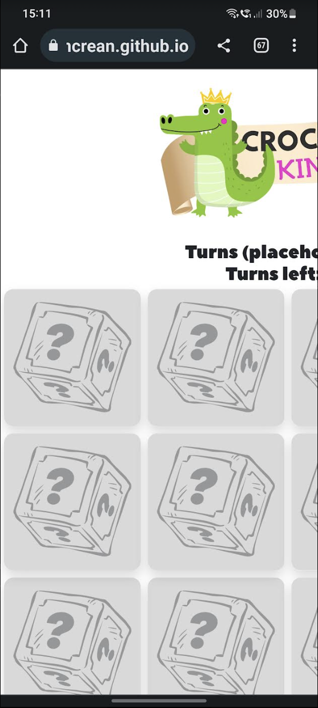
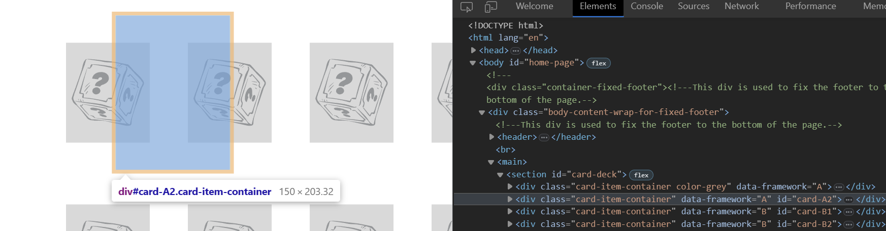

<div align="center">


# Issues and Bugs<!-- omit in toc -->
[](https://lmcrean.github.io/Crocodile-Kingdom/) [](https://github.com/lmcrean/Crocodile-Kingdom/blob/main/README.md)

This page documents the most challenging issues and bugs encountered during the development of the Crocodile Kingdom game. It also documents the solutions found to fix them.

</div>

## Table of Contents <!-- omit in toc -->
- [1. Javascript Structure Issues](#1-javascript-structure-issues)
  - [1.1. Card Deck Structure](#11-card-deck-structure)
    - [1.1.1. Double click too fast and the card won't flip](#111-double-click-too-fast-and-the-card-wont-flip)
    - [1.1.2. Click on a different card inbetween the 2 second interval, and it doesn't flip the cards back properly](#112-click-on-a-different-card-inbetween-the-2-second-interval-and-it-doesnt-flip-the-cards-back-properly)
    - [1.1.3. The shuffle algorithim doesn't appear to be working with "Display: Grid"](#113-the-shuffle-algorithim-doesnt-appear-to-be-working-with-display-grid)
    - [1.1.4. Using brackets to start the shuffle function seems to stop the cards from flipping](#114-using-brackets-to-start-the-shuffle-function-seems-to-stop-the-cards-from-flipping)
    - [1.1.5. Need to complete Shuffle Algorithm with display: flex method](#115-need-to-complete-shuffle-algorithm-with-display-flex-method)
  - [1.2. Turn Counter is not updating](#12-turn-counter-is-not-updating)
  - [1.3. Restart Button: After restart, the matched cards stay in a locked state.](#13-restart-button-after-restart-the-matched-cards-stay-in-a-locked-state)
  - [1.4. SFX Button: Card-flip SFX does not always play on 2nd turn, if user clicks too fast](#14-sfx-button-card-flip-sfx-does-not-always-play-on-2nd-turn-if-user-clicks-too-fast)
  - [1.5 High Score Table is not yet updating](#15-high-score-table-is-not-yet-updating)
  - [1.5.1 Still solving High Score Table (see above), at the moment 3 new functions added to script.js but not displaying in console.log](#151-still-solving-high-score-table-see-above-at-the-moment-3-new-functions-added-to-scriptjs-but-not-displaying-in-consolelog)
- [2. CSS Skeleton Issues and Bugs](#2-css-skeleton-issues-and-bugs)
  - [2.1. Card Deck Skeleton](#21-card-deck-skeleton)
    - [2.1.1. Responsive grid is falling off the horizontal viewport in desktop view](#211-responsive-grid-is-falling-off-the-horizontal-viewport-in-desktop-view)
    - [2.1.2. Responsive grid is falling off the horizontal viewport in mobile view](#212-responsive-grid-is-falling-off-the-horizontal-viewport-in-mobile-view)
    - [2.1.3. Responsive grid is falling off the vertical viewport](#213-responsive-grid-is-falling-off-the-vertical-viewport)
    - [2.1.4. back of card doesn't fully cover card face underneath](#214-back-of-card-doesnt-fully-cover-card-face-underneath)
    - [2.1.5. with new "display: flex" method, card-face moves to side in flipped state](#215-with-new-display-flex-method-card-face-moves-to-side-in-flipped-state)
    - [2.1.6. Slight x-overflow in desktop view](#216-slight-x-overflow-in-desktop-view)
  - [2.2. would prefer Footer responsive design to meet the edges](#22-would-prefer-footer-responsive-design-to-meet-the-edges)
  - [2.3. installing fonts](#23-installing-fonts)
- [3. Unfixed Bugs](#3-unfixed-bugs)

# 1. Javascript Structure Issues

<div align="center">

 

</div>

## 1.1. Card Deck Structure
<i>"I need the design to be accessible, easy to read with lots of visuals. I need the tone of the design to appear warm, entertaining and encouraging."</i>

### 1.1.1. Double click too fast and the card won't flip
Problem (user is double/triple clicking too fast):

<div align=center><details><summary><b>click here to view a screen recording of the issue:</b></summary>
</details></div>

Solution:

implemented a ```resetCards``` function to reset the variables to their original values? Not sure if this was the direct solution, but it is now working.

```js
function disableCards(){
firstCard.removeEventListener("click", cardAppear);
secondCard.removeEventListener("click", cardAppear);
// .removeEventListener removes the event listener from the first card so that it can't be clicked again.})
resetCards (); // unlocks the cards so that the user can click on them again.
}

// ----------------- ???Do the cards match??? (no) -----------------
// ...then clicked images flip back after 2 seconds
// ...then wait for "User Clicks on 1st card"

function flipBackCards() {
  lockCards = true; // This prevents the user from clicking on more than 2 cards at a time.

setTimeout(() => {
  firstCard.classList.remove("flipped-over");
  secondCard.classList.remove("flipped-over");
  resetCards (); // unlocks the cards so that the user can click on them again.
  }, 2000);
}


function resetCards() {// This function resets the variables to their original values.
  [hasFlippedCard, lockCards] = [false, false];
  [firstCard, secondCard] = [null, null];
}
```

<div align=center><details><summary><i>click here to view a screen recording with the solution:</i></summary>

</details></div>


### 1.1.2. Click on a different card inbetween the 2 second interval, and it doesn't flip the cards back properly

Problem:
<div align=center><details><summary><b>click here to view a screen recording of the issue:</b></summary>
</details></div>


Solution: 
used ```let lockCards = false```  rule to lock the board when the cards are flipped. Credit to code-sketch tutorial on youtube for the solution.

```js
function cardAppear() { 

if (lockCards) return; // This stops the function of lockCards is true, preventing the user from clicking on more than 2 cards at a time.
[...]

}

[...]

function flipBackCards() {
  lockCards = true; // This prevents the user from clicking on more than 2 cards at a time.

setTimeout(() => {
  firstCard.classList.remove("flipped-over");
  secondCard.classList.remove("flipped-over");
  lockCards = false; // unlocks the cards so that the user can click on them again.
  }, 2000);
}
```

<div align=center><details><summary><i>click here to view a screen recording with the solution:</i></summary>

</details></div>

### 1.1.3. The shuffle algorithim doesn't appear to be working with "Display: Grid"
<div align=center><details><summary><b>click here to view a screen recording of the issue:</b></summary>
</details></div>


***
Have added this shuffle algorthim to the javascript to randomise the order of the cards with the help of [code-sketch's tutorial](https://www.youtube.com/watch?v=NGtx3EBlpNE&list=PLLX1I3KXZ-YH-woTgiCfONMya39-Ty8qw&index=13). 

```js
(function shuffleCards () { 
  cards.forEach(card => {
    let randomPosition = Math.floor(Math.random() * 16); // This variable generates a random number between 0 and 16.
    card.style.order = randomPosition; // This changes the order of the cards to the random number generated above.
  })
})(); // This function is put in brackets to make it run as soon as the page loads.
```

However, once this is added, the cards won't flip.

resources searched:
- https://www.w3schools.com/jsref/prop_style_order.asp

and so tried adding card ID's to the HTML.

```html
<div class="card-item-container" data-framework="H" id="card-H2"> 
```

then using getElementById to select the card.

```js
    document.getElementById("card-A1").style.order = randomPosition;
    document.getElementById("card-A2").style.order = randomPosition; 
    document.getElementById("card-B1").style.order = randomPosition;
    document.getElementById("card-B2").style.order = randomPosition;
    document.getElementById("card-C1").style.order = randomPosition;
   [...etc.]
```

does not work.

Remaining issues:
1. The shuffleCards function is missing an array of card elements (cards) that it needs to shuffle. This array should be defined before the function is called.

2. The current implementation is not efficient and can lead to cards having the same order, causing them to overlap visually. Instead, it's better to update the card order based on the shuffled array.

Tried using an array-based approach function in JS:
  
```js
function shuffleCards() {
  const cardIds = Array.from(cards).map(card => card.id); // Get an array of card IDs
  const shuffledCardIds = shuffleArray(cardIds); // Shuffle the array of card IDs
  cards.forEach((card, index) => {
    card.style.order = shuffledCardIds[index]; // Update the order based on shuffled array
  });
}

// Helper function to shuffle an array using Fisher-Yates algorithm
function shuffleArray(array) { 
  for (let i = array.length - 1; i > 0; i--)// Loop from end of array to start 
  {
    const j = Math.floor(Math.random() * (i + 1)) // Random index from 0 to i;
    [array[i], array[j]] = [array[j], array[i]]; // Swap elements array[i] and array[j]
  }
  return array;
}
```

Tried rearranging shuffleArray with shuffleCards

```js
const cardsContainer = document.querySelector(".cards-container");
const cards = document.querySelectorAll(".card-item-container");
const j = Math.floor(Math.random() * (i + 1));

i = array.length - 1; // Initialize 'i' here
let hasFlippedCard = false; // This variable is set to false because the card has not been clicked yet.
let firstCard, secondCard; // These variables are set to undefined because the card has not been clicked yet.
let lockCards = false; // This variable is set to false because the card has not been clicked yet. This variable is used to prevent the user from checking more than 2 cards at a time.

let i = array.length - 1; i > 0; i--;
// Helper function to shuffle an array using Fisher-Yates algorithm

function shuffleArray(array) { 
  console.log("shufflesArray");
  for (let i = array.length - 1; i > 0; i--) { // Loop from end of array to start sure
  const j = Math.floor(Math.random() * (i + 1));
   [array[i], array[j]] = [array[j], array[i]]; // Swap elements array[i] and array[j] }
  return array;
}}

function shuffleCards() {
  console.log("shufflesCards");
  const cardIds = Array.from(cards).map(card => card.id); // Get an array of card IDs
  const shuffledCardIds = shuffleArray(cardIds); // Shuffle the array of card IDs
  cards.forEach((card, index) => {
    card.style.order = shuffledCardIds[index]; // Update the order based on shuffled array
  });
}
```

however getting this message
```
script.js:54 Uncaught ReferenceError: shuffleArray is not defined
    at shuffleCards (script.js:54:27)
    at script.js:60:3
```
shuffleArray is being called before it has been defined. Order doesn't seem to influence.


***
Stack Overflow forum, "how to randomize placement order in a placement grid", https://stackoverflow.com/questions/73847991/how-to-randomize-placement-order-in-a-css-grid

Recommended this:


```js
function makeBoard() {
        var str = "";
        for (var i = 1; i <= 25; i++) {
            str += "<div class = 'grid-item'>" + i + "</div>";
        }
        document.getElementById("bingo").innerHTML = str;
    }

    function shuffleBoard() {
        var numbers = [1, 2, 3, 4, 5, 6, 7, 8, 9, 10, 11, 12, 13, 14, 15, 16, 17, 18, 19, 20, 21, 22, 23, 24, 25];
        var str = "";
        while (numbers.length > 0) {
            var i = Math.floor(Math.random() * numbers.length);
            str += "<div class = 'grid-item'>" + numbers[i] + "</div>";
            numbers.splice(i, 1);
        }
        document.getElementById("bingo").innerHTML = str;
    }
```

- [ ] Stack Overflow Forum, "Shuffle a container's DOM elements, but not all",
https://stackoverflow.com/questions/71617327/shuffle-a-containers-dom-elements-but-not-all-in-javascript

- [ ] CodePen, shuffle grid items, https://codepen.io/GreenSock/pen/KKNJYZM

- [x] researched other memory games with CSS grid, but upon they seemed to have more bugs and missing shuffle functions: https://codepen.io/virmasalo/pen/XRmyYE
- [x] researched this more advanced memory game https://www.khanacademy.org/computer-programming/memory-card-game/5648647542833152

**Result: This was an unsolved issue that began to introduce too much new material at the same time. The developer closed this issue by reverting to ```display: flex``` and thereby offering the opportunity to study a functioning example with [code-sketch](https://marina-ferreira.github.io/projects/js/memory-game/)**

***
At this point the options are to:
- use ```display: flex``` instead of ```display: grid``` and copy [code-sketches' version](https://marina-ferreira.github.io/projects/js/memory-game/). This turned out to be a good solution and have had no issues since.


### 1.1.4. Using brackets to start the shuffle function seems to stop the cards from flipping

<div align=center><details><summary><b>click here to view a screen recording of the issue:</b></summary>
</details></div>

- [x] have tried removing entire shuffleCards and shuffleArray function, the result displays exactly the same as above.

- [x] **solution: hard refreshing the browser, the result is as below.** 


### 1.1.5. Need to complete Shuffle Algorithm with display: flex method
<div align=center><details><summary><b>click here to view a screen recording of the issue:</b></summary>
</details></div>

- [x] Implemented shuffleCards function as taught in code-sketch tutorial

```js
(function shuffleCards () { 
  cards.forEach(card => {
    let randomPosition = Math.floor(Math.random() * 16); // This variable generates a random number between 0 and 16.
    card.style.order = randomPosition; // This changes the order of the cards to the random number generated above.
  })
})(); // This function is put in brackets to make it run as soon as the page loads.
```

- [x] **Result: it's now shuffling correctly**

<div align=center><details><summary><b>click here to view a screen recording of the solution:</b></summary>

**Video 1 with cards shuffled correctly:**
[](assets/media/issues/1.1.5.mp4)

**Video 2 presents fresh shuffle:**

[](assets/media/issues/1.1.5b.mp4)

</details></div>

That concludes the essential structure of the card game.

## 1.2. Turn Counter is not updating
<div align=center><details><summary><b>click here to view a screen recording of the issue:</b></summary>
</details></div>

- turn counter does not update


HTML:
```html
<section id="score-count">
  <h2 class="attempts-count">Turns: <span id="attempts">0</span></h2>
</section>
```

JS:
Establishing the variables:
```js
const attemptsContainer = document.querySelector(".attempts"); // This variable selects the attempts class from the HTML, which is used to display the number of attempts the user has taken. It has started at 0.
```

```js
let attemptsCount = 0;  // attempts starts at 0
```

establishing the function:
```js
 //attempts counter
attemptsCount = 0;
attemptsContainer.innerHtml = 0;
 
function plusOneAttempts() {
  attemptsCount++;
  attemptsContainer.innerHTML = attemptsCount;
  }
```

add plusOneAttempts the functions:
```js
function disableCards(){
firstCard.removeEventListener("click", cardAppear);
secondCard.removeEventListener("click", cardAppear);
// .removeEventListener removes the event listener from the two selected cards so that they can't be clicked again.})

resetCards (); // unlocks the board so that the user can click on new cards again.

plusOneAttempts(); // adds 1 to the attempts counter

}
```

```js
function flipBackCards() {
  lockCards = true; // This statement is set to true so that the user can't click on more than 2 cards at a time.

setTimeout(() => {
  firstCard.classList.remove("flipped-over");
  secondCard.classList.remove("flipped-over"); // removes the HTML class of "flipped-over" on the card that it is clicked on. This flips the card back over.
  resetCards (); // unlocks the cards so that the user can click on them again.
  },
  2000); // This sets a timer of 2 seconds before the cards flip back over.

  plusOneAttempts(); // adds 1 to the attempts counter
}
```

Resources consulted:
- https://codepen.io/WebDevSimplified/pen/EdEjyx
- https://github.com/moirahartigan/Portfolio-2---Alien-Memory-Game/blob/master/assets/js/script.js
- Devtools console reveals this error message upon click


**Solution use getElementById instead of querySelector:**

HTML:
```html
<section id="score-count">
  <h2 class="attempts-count">Turns: <span id="attempts">0</span></h2>
</section>
```

JS:
Establishing the variables **with getElementById**:
```js
const attemptsContainer = document.getElementById("attempts"); // This variable selects the attempts class from the HTML, which is used to display the number of attempts the user has taken. It has started at 0.
```

```js
let attemptsCount = 0;  // attempts starts at 0
```

establishing the function:
```js
 //attempts counter
attemptsCount = 0;
 
function plusOneAttempts() {
  let oldAttempt = parseInt(attemptsContainer.innerText);
  attemptsContainer.innerText = ++oldAttempt;
}
```

add ```plusOneAttempts ();``` inside the end of ```disableCards()``` and ```flipBackCards()``` :
```js
function disableCards(){
firstCard.removeEventListener("click", cardAppear);
secondCard.removeEventListener("click", cardAppear);
// .removeEventListener removes the event listener from the two selected cards so that they can't be clicked again.})

resetCards (); // unlocks the board so that the user can click on new cards again.

plusOneAttempts(); // adds 1 to the attempts counter

}
```

```js
function flipBackCards() {
  lockCards = true; // This statement is set to true so that the user can't click on more than 2 cards at a time.

setTimeout(() => {
  firstCard.classList.remove("flipped-over");
  secondCard.classList.remove("flipped-over"); // removes the HTML class of "flipped-over" on the card that it is clicked on. This flips the card back over.
  resetCards (); // unlocks the cards so that the user can click on them again.
  },
  2000); // This sets a timer of 2 seconds before the cards flip back over.

  plusOneAttempts(); // adds 1 to the attempts counter
}
```
<div align=center><details><summary><b>click here to view a screen recording of the solution: turn counter updates</b></summary>

</details></div>

## 1.3. Restart Button: After restart, the matched cards stay in a locked state.
<div align=center><details><summary><b>click here to view a screen recording of the issue:</b></summary>
</details></div>

```js
const restartButton = document.getElementById("restart-button"); // This variable selects the restart-button ID from the HTML

restartButton.addEventListener("click", restartGame); // This adds an event listener to the restart button. When the restart button is clicked, the function restartGame is run.

function restartGame() {
  cards.forEach(card => card.classList.remove

  ("flipped-over")); // This removes the HTML class of "flipped-over" from all cards, flipping them back over.
  shuffleCards (); // This reshuffles the cards.
  resetCards (); // This resets the variables to their original values.
  attemptsContainer.innerText = 0; // This resets the attempts counter to 0. 

  lockCards = false; // This statement is set to false so that the user can click on the cards again.
}
```

**the cards stay locked because this function is not being addressed in the restartGame function:**

```js
function disableCards(){
firstCard.removeEventListener("click", cardAppear);
secondCard.removeEventListener("click", cardAppear);
// .removeEventListener removes the event listener from the two selected cards so that they can't be clicked again.})

resetCards (); // unlocks the board so that the user can click on new cards again.

plusOneAttempts(); // adds 1 to the attempts counter

}
```

<div align=center><details><summary><b>click here to view a screen recording of the solution</b></summary>
</details></div>

The restart button is now unlocks all the cards.

inside restartgame () function, added ```cards.forEach(card => card.addEventListener("click", cardAppear));``` 

This adds an event listener to each card, as well as restores the "click" event listener from ```disablecards``` function (used to disable cards when the cards match). When the card is clicked, the function cardAppear is run and the card is flipped.

## 1.4. SFX Button: Card-flip SFX does not always play on 2nd turn, if user clicks too fast

Have tried:
- [x] using a second sound file
  - [x] using console.log to see if it runs

Solution use second SFX file.

```html
    <audio id="sfx-flip" class="sound-mute">
      <source src="assets/media/sound/flipcard-91468.mp3" type="audio/mpeg">
      Your browser does not support the audio element.
    </audio>
    <audio id="sfx-flip-2" class="sound-mute">
      <source src="assets/media/sound/flipcard-91468-copy.mp3" type="audio/mpeg">
      Your browser does not support the audio element.
    </audio>
```
<details><summary>click here to see mute toggle function:</summary>

```js
$(document).ready(function() {
  // When the sfx button is clicked...
  $('.toggle-sfx').on('click', function() {
    // Toggle the sound-mute class on the button...
    $(this).toggleClass('sound-mute');
    $('#sfx-flip').toggleClass('sound-mute');
    $('#sfx-flip-2').toggleClass('sound-mute');
    $('#sfx-match').toggleClass('sound-mute');
    $('#sfx-no-match').toggleClass('sound-mute');
    $('#sfx-win').toggleClass('sound-mute');
    $('#sfx-lose').toggleClass('sound-mute');
  });
});
```
</details>

```js
const sfxFlip = document.getElementById('sfx-flip'); // This variable selects the sfx-flip ID from the HTML

const sfxFlip2 = document.getElementById('sfx-flip-2'); // This variable selects the sfx-flip2 ID from the HTML
```

```js
const sfxFlip = document.getElementById('sfx-flip'); // This variable selects the sfx-flip ID from the HTML

const sfxFlip2 = document.getElementById('sfx-flip-2'); // This variable selects the sfx-flip2 ID from the HTML
```

solution: insert ```sfxFlip2.play();``` into ```cardAppear()``` function

```js

function cardAppear() { 


[...]

//check if sfxFlip has class sound-mute

if (!sfxFlip.classList.contains('sound-mute')) {
  sfxFlip.play(); // This plays the flip sound effect when the card is clicked on.
}

if (!hasFlippedCard) { //"!"" references the opposite of hasFlippedCard. In the game, this would mean that the user has not clicked on a card yet. If the user has not clicked on a card yet, then run the following code.
  hasFlippedCard = true; 
  firstCard = this; // "this" refers to the card that is clicked on. // In this scenario, the user is trying to click on the same card twice. 
  return;} // [...]
  hasFlippedCard = false; // in this scenario, the user is trying to click on a new card while another is flipped over. This resets the variable to false so that the user can click on a new card.
  secondCard = this; // "this" refers to the card that is clicked on. This would mean that the user has clicked on a card already. If the user has clicked on a card already, then run the following code.
  if (!sfxFlip2.classList.contains('sound-mute')) {
    sfxFlip2.play(); // This plays the second flip sound effect when the card is clicked on.
    console.log("sfxFlip2 is not muted, should be playing"); //console.log fired
  };
  [...]
}
```

## 1.5 High Score Table is not yet updating

<div align=center><details><summary><b>click here to view a screen recording of the issue:</b></summary>

</details></div>


<details><summary> click here to view problem HTML:</summary>

```html
      <!--enter your name feature: invisible button and modal -->
<!-- Enter your name button -->
<button type="button" class="btn btn-secondary" data-bs-toggle="modal" data-bs-target="#enter-name-modal">
  Enter Your Name
</button>

<!-- Enter your name modal -->
<div class="modal fade" id="enter-name-modal" tabindex="-1" aria-labelledby="enterNameModalLabel" aria-hidden="true">
  <div class="modal-dialog modal-dialog-centered">
    <div class="modal-content">
      <div class="modal-header">
        <h5 class="modal-title" id="enterNameModalLabel">Enter Your Name 👇</h5>
        <button type="button" class="btn-close" data-bs-dismiss="modal" aria-label="Close"></button>
      </div>
      <div class="modal-body">
        <!-- Add a form to input the name -->
        <form>
          <div class="mb-3">
            <label for="playerName" class="form-label">Name:</label>
            <input type="text" class="form-control" id="playerName" placeholder="Enter your name here" required>
          </div>
        </form>
      </div>
      <div class="modal-footer">
        <!-- Add a button to submit the name -->
        <button type="button" class="btn btn-primary" id="submitNameBtn">Submit</button>
        <button type="button" class="btn btn-secondary" data-bs-dismiss="modal">Close</button>
      </div>
    </div>
  </div>
</div>

      <!--simple high score feature: invisible button and modal-->

<!-- High score button -->
<button type="button" class="btn btn-secondary" data-bs-toggle="modal" data-bs-target="#high-score-modal">
  High Score
</button>

<!-- High score modal -->
<div class="modal fade" id="high-score-modal" tabindex="-1" aria-labelledby="highScoreModalLabel" aria-hidden="true">
  <div class="modal-dialog modal-dialog-centered">
    <div class="modal-content">
      <div class="modal-header">
        <h5 class="modal-title" id="highScoreModalLabel"></h5>
        <button type="button" class="btn-close" data-bs-dismiss="modal" aria-label="Close"></button>
      </div>
      <div class="modal-body">
        <h1>High Score🏆</h1>
        <!-- Display the high scores here -->
        <table class="table table-striped table-hover">
          <thead>
            <tr>
              <th scope="col">Rank</th>
              <th scope="col">Name</th>
              <th scope="col">Score (Turns Left)</th>
            </tr>
          </thead>
          <tbody id="highScoreTable">
          </tbody>
        </table>
      </div>
      <div class="modal-footer">
        <button type="button" class="btn btn-secondary" data-bs-dismiss="modal">Close</button>
      </div>
    </div>
  </div>
</div>
```
</details>

<details><summary> click here to view problem JS:</summary>

```js
// Javascript to record the score

// Retrieve the User Name from the input field in the Enter Your Name modal
const userName = document.getElementById('userName').value;

// Retrieve the high scores from Turns left count on the main page
const userScore = document.getElementById('turns-left-count').textContent;

// Get the tbody element by its id
const tbody = document.getElementById('highScoreTable');

// Update and display high scores in the tbody element
function updateHighScores(userName, userScore) {

  // Create a new score object
  const highScores = JSON.parse(localStorage.getItem('highScores')) || []; // If there are no high scores, then create an empty array

  // Display the high scores in the table
  highScores.forEach((score, index) => {
    const row = document.createElement('tr');
    row.innerHTML = `
      <td>${index + 1}</td>
      <td>${score.name}</td>
      <td>${score.score}</td>
    `;
    tbody.appendChild(row);
  });
}
```
</details>
<br>

**Main Article consulted:**
https://michael-karen.medium.com/how-to-save-high-scores-in-local-storage-7860baca9d68

This article walks through how to save a high score using local storage.

Once local storage is created, the next step is to create a function that will update the high scores in the table.

```js
// Update and display high scores in the tbody element
const highScoreString = localStorage.getItem(HIGH_SCORES);
const highScores = JSON.parse(highScoreString) ?? [];
```

> The nullish coalescing operator (??) is a logical operator that returns its right-hand side operand when its left-hand side operand is null or undefined, and otherwise returns its left-hand side operand.


**Debugging steps**
1. Created localstorage.js
2. Added ```<script src="assets/js/localstorage.js"></script>``` to index.html
3. use console.log to record the value of userName and userScore

```js
// JavaScript to handle the transition from "Enter Your Name" to "High Scores"
document.getElementById('submitNameBtn').addEventListener('click', function() {
  $('#enter-name-modal').modal('hide'); // Close the "Enter Your Name" modal
  console.log($('#playerName').val());
  console.log($('#turns-left-count').text());
  $('#high-score-modal').modal('show'); // Show the "High Scores" modal
});
```
console log:
 --it works

4. add ```updateHighScores(userName, userScore);``` to the end of the function above 
```js
updateHighScores($('#playerName').val(), $('#turns-left-count').text()); // Update the high scores in the table
```

5. add checkHighScore function to end of game, when the user clicks button to submit their name

```js
document.getElementById('submitNameBtn').addEventListener('click', function() {
  $('#enter-name-modal').modal('hide'); // Close the "Enter Your Name" modal
  console.log($('#playerName').val());
  console.log($('#turns-left-count').text());
  $('#high-score-modal').modal('show'); // Show the "High Scores" modal
  updateHighScores($('#playerName').val(), $('#turns-left-count').text()); // Update the high scores in the table
  checkHighScore($('#turns-left-count').text()); // Check if the user's score is a high score
});
```

6. Add saveHighScore function to script.js that achieves the following

see the markdown for what steps are followed.

```js
function saveHighScore(score, highScores) {
  const name = prompt('You got a highscore! Enter name:');
  const newScore = { score, name };
  
  // 1. Add to list
  highScores.push(newScore);

  // 2. Sort the list
  highScores.sort((a, b) => b.score - a.score);
  
  // 3. Select new list
  highScores.splice(NO_OF_HIGH_SCORES); // Remove scores after the top 5
  
  // 4. Save to local storage
  localStorage.setItem(HIGH_SCORES, JSON.stringify(highScores));
};
```

7. to show the scores on the screen with table id #highScoreTable

```js
function showHighScores() {
  const highScores = JSON.parse(localStorage.getItem(HIGH_SCORES)) ?? [];
  const highScoreList = document.getElementById(HIGH_SCORES);
  
 // Display the high scores in the table id "highScoreTable"
  highScores.forEach((score, index) => {
    const row = document.createElement('tr');
    row.innerHTML = `
      <td>${index + 1}</td>
      <td>${score.name}</td>
      <td>${score.score}</td>
    `;
    tbody.appendChild(row);
  });
}
```

**Other Articles**
- https://dev.to/minna_xd/adding-a-high-score-table-to-javascript30-whack-a-mole-4adk
- https://github.com/melcor76/js-tetris github repo of the main article, nice use of highscore embedded during gameplay

## 1.5.1 Still solving High Score Table (see above), at the moment 3 new functions added to script.js but not displaying in console.log


<div align=center></div>
<!------------------------------------------------>

# 2. CSS Skeleton Issues and Bugs
<div align=center>

 

</div>


## 2.1. Card Deck Skeleton

### 2.1.1. Responsive grid is falling off the horizontal viewport in desktop view

<div align=center><details><summary><b>click here to view a screen recording of the issue:</b></summary>


</details></div>

Seems okay in browser view, but not Devtools. Need the correct CSS Functions to

- [x] make the grid responsive to viewport width
- [x] make cards overlap each other


**Solution:**
- Hard refreshed the browser.
- Reordered the html so that the card-back appears on top.
- Used ```object-fit:contain``` to let the images fit the card size.
- Improved sizing by changing card-item max-width from 25% to 100%
used padding: 0px 1em to improve spacing between cards;

<div align=center><details><summary><b>click here to view a screen recording of the solution:</b></summary>
</details></div>

### 2.1.2. Responsive grid is falling off the horizontal viewport in mobile view

<div align=center><details><summary><b>click here to view a screen recording of the issue:</b></summary>
</details></div>


solution: use vw instead of %, seems to work now.

```css
#card-deck {
  width: 90vw;
  height: 90vw;
}
```

<div align=center><details><summary><b>click here to view a screen recording of the solution:</b></summary>
</details></div>


tested with Chrome on Samsung Galaxy S21

### 2.1.3. Responsive grid is falling off the vertical viewport
have tried ```max-height: 100vh``` and ```max-height: 100%``` but neither work.

<div align=center><details><summary><b>click here to view a screen recording of the issue:</b></summary>

 </details></div>


solution: use max width and max height at 90vh. This seems to work.

```css
#card-deck {
  width: 90vw;
  height: 90vw;
  max-width: 90vh;
  max-height: 90vh;
  margin: 2em auto;
  display: flex;
  flex-wrap: wrap;
  align-content: flex-start;
}
```
<div align=center><details><summary><b>click here to view a screen recording of the solution:</b></summary>

</details></div></details></div>


### 2.1.4. back of card doesn't fully cover card face underneath

<div align=center><details><summary><b>click here to view a screen recording of the issue:</b></summary>

</details></div>

This issues within ```#card-deck``` was eventually resolved inadvertently during the switch from ```display: grid``` to ```display: flex```

### 2.1.5. with new "display: flex" method, card-face moves to side in flipped state

<div align=center><details><summary><b>click here to view a screen recording of the issue:</b></summary>




</details></div>


- [x] devtools inspection
  - [x] inspect backface-visibility
  - [x] inspect which items disappear in flipped state


Devtools suggests it appears that the a2 container is pushed slightly to the right.

- [x] removed padding from .card-item, looks a bit healthier

- [x] **Solution: add `display: flex` to card-item-container**
```css
.card-item-container {
  width: calc(25% - 10px);
  height: calc(33.333% - 10px);
  margin: 5px;
  position: relative;
  display: flex;
}
```

Result: functions same as ```display: grid``` version now

<div align=center><details><summary><b>click here to view a screen recording of the solution:</b></summary>


</details></div>


now to solve the shuffle issue.

### 2.1.6. Slight x-overflow in desktop view
<div align=center><details><summary><b>click here to view a screen recording of the issue:</b></summary>

</details></div>


solution: use vw units instead of fr for grid-template-columns, prevents the cards automatically spilling out. 

```css
@media screen and (min-width: 1208px) {
.gameplay-display-grid {
  display: grid;
  grid-template-columns: 33vw 67vw;
  grid-template-rows: auto;
  grid-template-areas:
    "logo cards"
    "turns-count cards"
    "restart cards"
    "how-to-play cards"
    "footer footer";
  margin: 3px auto auto 0px;
  left: 0px;
}
```
Then use max-height and max-width:
```css
#card-deck {
  width: 90vw;
  height: 90vw;
  max-width: 40em;
  max-height: 40em;
  margin: 2em auto;
  display: flex;
  flex-wrap: wrap;
  align-content: flex-start;
}

@media screen and (min-width:1208px) {
  #card-deck {
    width: 45em;
    height: 45em;
    max-width: 45em;
    max-height: 45em;
    margin-left: 3rem;
  }
}

@media screen and (min-width:1708px) {
  #card-deck {
    width: 55em;
    height: 55em;
    max-width: 50vw;
    max-height: 50vw;
  }
}
```

## 2.2. would prefer Footer responsive design to meet the edges 
<div align=center><details><summary><b>click here to view a screen recording of the issue:</b></summary>


</details></div>


solution was to use % instead of vw for the footer width, worked better. Was fixed in this [commit here. ](https://github.com/lmcrean/Crocodile-Kingdom/commit/d4b510ff78c12510dbb263bb7f1c253019cf0d75)

<div align=center><details><summary><b>click here to view a screen recording of the solution:</b></summary>

</details></div>


## 2.3. installing fonts 

Todo list:
- [x] downloaded fonts
- [x] installed fonts as files
- [x] used @font-face to connect typography to CSS
  - [x] what is the correct syntax for this?

solution
```css
@font-face {
  font-family: "HussarBoldWebEdition";
  src: url("https://lmcrean.github.io/Crocodile-Kingdom/assets/fonts/HussarBoldWeb.eot") format("eot"), url("https://lmcrean.github.io/Crocodile-Kingdom/assets/fonts/HussarBoldWeb.woff") format("woff"), url("https://lmcrean.github.io/Crocodile-Kingdom/assets/fonts/HussarBoldWeb.ttf") format("truetype"), url("https://lmcrean.github.io/Crocodile-Kingdom/assets/fonts/HussarBoldWeb.svg#HussarBoldWeb") format("svg");
  font-weight: normal;
  font-style: normal;
}

@font-face {
  font-family: "AmazingGroteskDemi";
  src: url("https://lmcrean.github.io/Crocodile-Kingdom/assets/fonts/AmazingGroteskDemi.woff") format("woff"), url;
  font-weight: normal;
  font-style: normal;
}

/*These type selectors are all Peace Sans*/
h1, h2, label {
  font-family: 'HussarBoldWebEdition', sans-serif;
}

/* These type selectors are all Glacial Indifference*/
p, h3, h4, h5, a,
form input{
  font-family: 'AmazingGroteskDemi', sans-serif;
}

```

Resources consulted:
https://www.pagecloud.com/blog/how-to-add-custom-fonts-to-any-website


<div align=center><details><summary><b>click here to view a screen recording of the solution:</b></summary>


</details></div>


# 3. Unfixed Bugs

xxxxxxxxxxxxxx update at the end.

