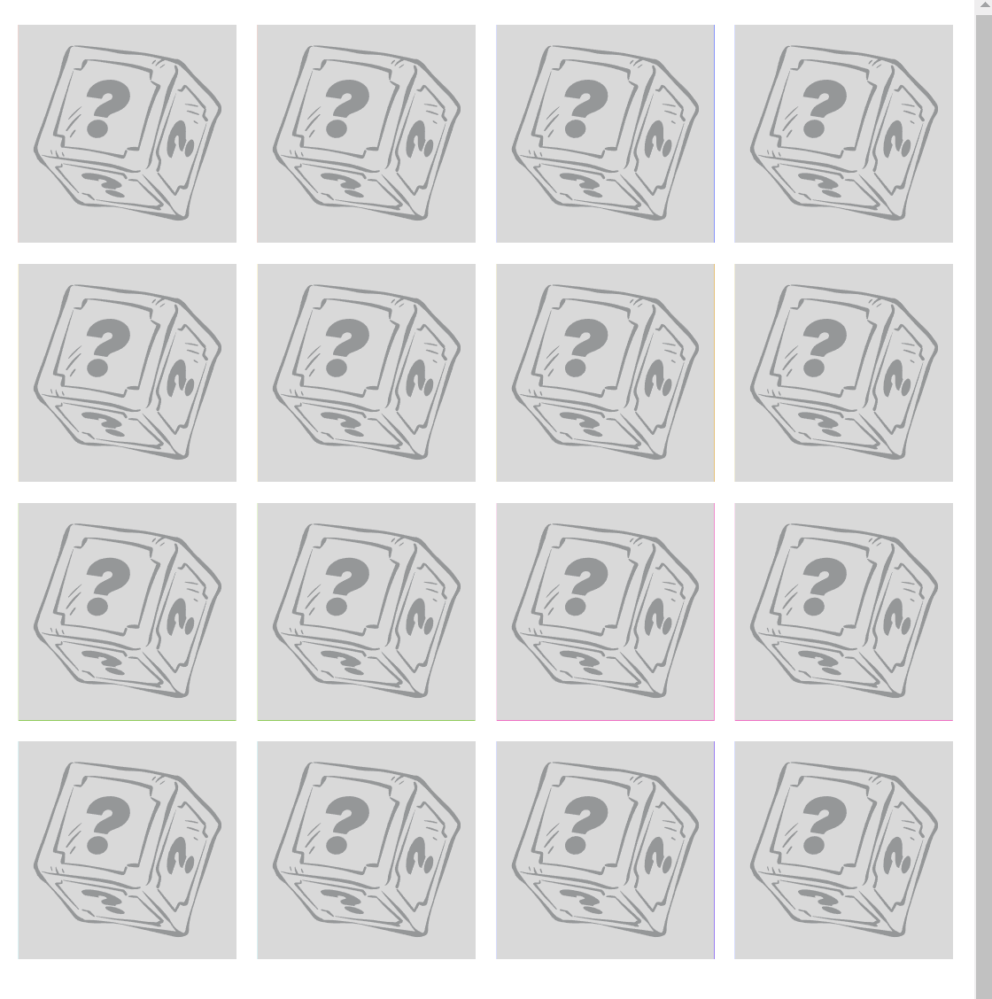

<div align="center">


# Issues and bugs<!-- omit in toc -->
[](https://lmcrean.github.io/Crocodile-Kingdom/) [](https://github.com/lmcrean/Crocodile-Kingdom/blob/main/README.md)

This page documents the issues and bugs encountered during the development of the Crocodile Kingdom game. It also documents the solutions found to fix them.

</div>

## Table of Contents <!-- omit in toc -->
- [1. Javascript Structure Issues](#1-javascript-structure-issues)
  - [1.1. Card Deck Structure](#11-card-deck-structure)
    - [1.1.1. Double click too fast and the card won't flip](#111-double-click-too-fast-and-the-card-wont-flip)
    - [1.1.2. Click on a different card inbetween the 2 second interval, and it doesn't flip the cards back properly](#112-click-on-a-different-card-inbetween-the-2-second-interval-and-it-doesnt-flip-the-cards-back-properly)
    - [1.1.3. The shuffle algorithim doesn't appear to be working with ```Display: Grid``` (issue closed)](#113-the-shuffle-algorithim-doesnt-appear-to-be-working-with-display-grid-issue-closed)
    - [1.1.4. Using brackets to start the shuffle function seems to stop the cards from flipping](#114-using-brackets-to-start-the-shuffle-function-seems-to-stop-the-cards-from-flipping)
    - [1.1.5 Need to complete Shuffle Algorithm with display: flex method](#115-need-to-complete-shuffle-algorithm-with-display-flex-method)
- [2. CSS Skeleton Issues and Bugs](#2-css-skeleton-issues-and-bugs)
  - [2.1 Card Deck Skeleton](#21-card-deck-skeleton)
    - [2.1.1 Responsive grid is falling off the horizontal viewport ✔️](#211-responsive-grid-is-falling-off-the-horizontal-viewport-️)
    - [2.1.2. Responsive grid is falling off the vertical viewport](#212-responsive-grid-is-falling-off-the-vertical-viewport)
    - [2.1.3. back of card doesn't fully cover card face underneath](#213-back-of-card-doesnt-fully-cover-card-face-underneath)
    - [2.1.4. with new "display: flex" method, card-face moves to side in flipped state](#214-with-new-display-flex-method-card-face-moves-to-side-in-flipped-state)
- [4. Unfixed Bugs](#4-unfixed-bugs)

# 1. Javascript Structure Issues

 

## 1.1. Card Deck Structure
<i>"I need the design to be accessible, easy to read with lots of visuals. I need the tone of the design to appear warm, entertaining and encouraging."</i>

### 1.1.1. Double click too fast and the card won't flip
Problem (user is double/triple clicking too fast):


Solution:

implemented a ```resetCards``` function to reset the variables to their original values? Not sure if this was the direct solution, but it is now working.

```js
function disableCards(){
firstCard.removeEventListener("click", cardAppear);
secondCard.removeEventListener("click", cardAppear);
// .removeEventListener removes the event listener from the first card so that it can't be clicked again.})
resetCards (); // unlocks the cards so that the user can click on them again.
}

// ----------------- ???Do the cards match??? (no) -----------------
// ...then clicked images flip back after 2 seconds
// ...then wait for "User Clicks on 1st card"

function flipBackCards() {
  lockCards = true; // This prevents the user from clicking on more than 2 cards at a time.

setTimeout(() => {
  firstCard.classList.remove("flipped-over");
  secondCard.classList.remove("flipped-over");
  resetCards (); // unlocks the cards so that the user can click on them again.
  }, 2000);
}


function resetCards() {// This function resets the variables to their original values.
  [hasFlippedCard, lockCards] = [false, false];
  [firstCard, secondCard] = [null, null];
}
```

Result:


### 1.1.2. Click on a different card inbetween the 2 second interval, and it doesn't flip the cards back properly

Problem:


Solution: 
used ```let lockCards = false```  rule to lock the board when the cards are flipped. Credit to code-sketch tutorial on youtube for the solution.

```js
function cardAppear() { 

if (lockCards) return; // This stops the function of lockCards is true, preventing the user from clicking on more than 2 cards at a time.
[...]

}

[...]

function flipBackCards() {
  lockCards = true; // This prevents the user from clicking on more than 2 cards at a time.

setTimeout(() => {
  firstCard.classList.remove("flipped-over");
  secondCard.classList.remove("flipped-over");
  lockCards = false; // unlocks the cards so that the user can click on them again.
  }, 2000);
}
```

Result:


### 1.1.3. The shuffle algorithim doesn't appear to be working with ```Display: Grid``` (issue closed)



Have added this shuffle algorthim to the javascript to randomise the order of the cards with the help of [code-sketch's tutorial](https://www.youtube.com/watch?v=NGtx3EBlpNE&list=PLLX1I3KXZ-YH-woTgiCfONMya39-Ty8qw&index=13). 

```js
(function shuffleCards () { 
  cards.forEach(card => {
    let randomPosition = Math.floor(Math.random() * 16); // This variable generates a random number between 0 and 16.
    card.style.order = randomPosition; // This changes the order of the cards to the random number generated above.
  })
})(); // This function is put in brackets to make it run as soon as the page loads.
```

However, once this is added, the cards won't flip.

resources searched:
- https://www.w3schools.com/jsref/prop_style_order.asp

and so tried adding card ID's to the HTML.

```html
<div class="card-item-container" data-framework="H" id="card-H2"> 
```

then using getElementById to select the card.

```js
    document.getElementById("card-A1").style.order = randomPosition;
    document.getElementById("card-A2").style.order = randomPosition; 
    document.getElementById("card-B1").style.order = randomPosition;
    document.getElementById("card-B2").style.order = randomPosition;
    document.getElementById("card-C1").style.order = randomPosition;
   [...etc.]
```

does not work.

Remaining issues:
1. The shuffleCards function is missing an array of card elements (cards) that it needs to shuffle. This array should be defined before the function is called.

2. The current implementation is not efficient and can lead to cards having the same order, causing them to overlap visually. Instead, it's better to update the card order based on the shuffled array.

Tried using an array-based approach function in JS:
  
```js
function shuffleCards() {
  const cardIds = Array.from(cards).map(card => card.id); // Get an array of card IDs
  const shuffledCardIds = shuffleArray(cardIds); // Shuffle the array of card IDs
  cards.forEach((card, index) => {
    card.style.order = shuffledCardIds[index]; // Update the order based on shuffled array
  });
}

// Helper function to shuffle an array using Fisher-Yates algorithm
function shuffleArray(array) { 
  for (let i = array.length - 1; i > 0; i--)// Loop from end of array to start 
  {
    const j = Math.floor(Math.random() * (i + 1)) // Random index from 0 to i;
    [array[i], array[j]] = [array[j], array[i]]; // Swap elements array[i] and array[j]
  }
  return array;
}
```

Tried rearranging shuffleArray with shuffleCards

```js
const cardsContainer = document.querySelector(".cards-container");
const cards = document.querySelectorAll(".card-item-container");
const j = Math.floor(Math.random() * (i + 1));

i = array.length - 1; // Initialize 'i' here
let hasFlippedCard = false; // This variable is set to false because the card has not been clicked yet.
let firstCard, secondCard; // These variables are set to undefined because the card has not been clicked yet.
let lockCards = false; // This variable is set to false because the card has not been clicked yet. This variable is used to prevent the user from checking more than 2 cards at a time.

let i = array.length - 1; i > 0; i--;
// Helper function to shuffle an array using Fisher-Yates algorithm

function shuffleArray(array) { 
  console.log("shufflesArray");
  for (let i = array.length - 1; i > 0; i--) { // Loop from end of array to start sure
  const j = Math.floor(Math.random() * (i + 1));
   [array[i], array[j]] = [array[j], array[i]]; // Swap elements array[i] and array[j] }
  return array;
}}

function shuffleCards() {
  console.log("shufflesCards");
  const cardIds = Array.from(cards).map(card => card.id); // Get an array of card IDs
  const shuffledCardIds = shuffleArray(cardIds); // Shuffle the array of card IDs
  cards.forEach((card, index) => {
    card.style.order = shuffledCardIds[index]; // Update the order based on shuffled array
  });
}
```

however getting this message
```
script.js:54 Uncaught ReferenceError: shuffleArray is not defined
    at shuffleCards (script.js:54:27)
    at script.js:60:3
```
shuffleArray is being called before it has been defined. Order doesn't seem to influence.

***
At this point the options are to:
- use ```display: flex``` instead of ```display: grid``` and copy [code-sketches' version](https://marina-ferreira.github.io/projects/js/memory-game/). risk: leading to responsivity issues.
- continue to consult the articles below. risk: time and further complications.


***
Stack Overflow forum, "how to randomize placement order in a placement grid", https://stackoverflow.com/questions/73847991/how-to-randomize-placement-order-in-a-css-grid

Recommended this:


```js
function makeBoard() {
        var str = "";
        for (var i = 1; i <= 25; i++) {
            str += "<div class = 'grid-item'>" + i + "</div>";
        }
        document.getElementById("bingo").innerHTML = str;
    }

    function shuffleBoard() {
        var numbers = [1, 2, 3, 4, 5, 6, 7, 8, 9, 10, 11, 12, 13, 14, 15, 16, 17, 18, 19, 20, 21, 22, 23, 24, 25];
        var str = "";
        while (numbers.length > 0) {
            var i = Math.floor(Math.random() * numbers.length);
            str += "<div class = 'grid-item'>" + numbers[i] + "</div>";
            numbers.splice(i, 1);
        }
        document.getElementById("bingo").innerHTML = str;
    }
```

- [ ] Stack Overflow Forum, "Shuffle a container's DOM elements, but not all",
https://stackoverflow.com/questions/71617327/shuffle-a-containers-dom-elements-but-not-all-in-javascript

- [ ] CodePen, shuffle grid items, https://codepen.io/GreenSock/pen/KKNJYZM

- [x] researched other memory games with CSS grid, but upon they seemed to have more bugs and missing shuffle functions: https://codepen.io/virmasalo/pen/XRmyYE
- [x] researched this more advanced memory game https://www.khanacademy.org/computer-programming/memory-card-game/5648647542833152

**Result: This was an unsolved issue that began to introduce too much new material at the same time. The developer closed this issue by reverting to ```display: flex``` and thereby offering the opportunity to study a functioning example with [code-sketch](https://marina-ferreira.github.io/projects/js/memory-game/)**

### 1.1.4. Using brackets to start the shuffle function seems to stop the cards from flipping


- [x] have tried removing entire shuffleCards and shuffleArray function, the result displays exactly the same as above.

- [x] **solution: hard refreshing the browser, the result is as below.** 


### 1.1.5 Need to complete Shuffle Algorithm with display: flex method

[current result is same as image above]

- [x] Implemented shuffleCards function as taught in code-sketch tutorial

```js
(function shuffleCards () { 
  cards.forEach(card => {
    let randomPosition = Math.floor(Math.random() * 16); // This variable generates a random number between 0 and 16.
    card.style.order = randomPosition; // This changes the order of the cards to the random number generated above.
  })
})(); // This function is put in brackets to make it run as soon as the page loads.
```

Result: it's now shuffling correctly

**Refresh 1:**
[](assets/media/issues/1.1.5.mp4)

**Refresh 2:**

[](assets/media/issues/1.1.5b.mp4)

That concludes the essential structure of the card game.


<!------------------------------------------------>

# 2. CSS Skeleton Issues and Bugs
 


## 2.1 Card Deck Skeleton

### 2.1.1 Responsive grid is falling off the horizontal viewport ✔️


Seems okay in browser view, but not Devtools. Need the correct CSS Functions to

- [x] make the grid responsive to viewport width
- [x] make cards overlap each other


**Solution:**
- Hard refreshed the browser.
- Reordered the html so that the card-back appears on top.
- Used ```object-fit:contain``` to let the images fit the card size.
- Improved sizing by changing card-item max-width from 25% to 100%
used padding: 0px 1em to improve spacing between cards;


### 2.1.2. Responsive grid is falling off the vertical viewport
have tried ```max-height: 100vh``` and ```max-height: 100%``` but neither work.

 

- [ ] check W3 Schools for CSS functions to make the grid responsive to viewport height

### 2.1.3. back of card doesn't fully cover card face underneath


### 2.1.4. with new "display: flex" method, card-face moves to side in flipped state


- [x] devtools inspection
  - [x] inspect backface-visibility
  - [x] inspect which items disappear in flipped state


it appears that the a2 container is pushed slightly to the right. Let's inspect the elements.

- [x] removed padding from .card-item, looks a bit healthier

- [x] **Solution: add `display: flex` to card-item-container**
```css
.card-item-container {
  width: calc(25% - 10px);
  height: calc(33.333% - 10px);
  margin: 5px;
  position: relative;
  display: flex;
}
```

Result: functions same as ```display: grid``` version now


now to solve the shuffle issue.


# 4. Unfixed Bugs

xxxxxxxxxxxxxx update at the end.

